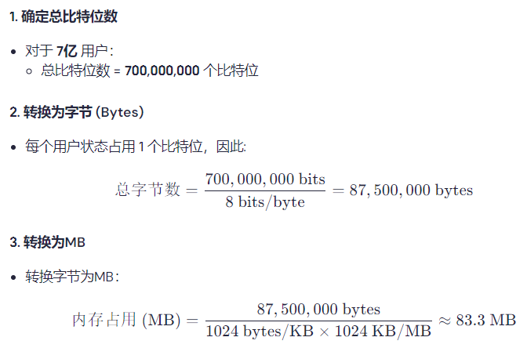

# 腾讯面试：如何统计王者荣耀7亿用户中有多少用户在线？


**<font style="color:rgba(0, 0, 0, 0.9);">面试经历分享</font>**

<font style="color:rgba(0, 0, 0, 0.9);">最近有小伙伴去腾讯面试，给我分享了他成功入职腾讯的面试经历。其中有一道面试题他印象深刻，当时</font><font style="color:rgba(0, 0, 0, 0.9);">面试官丢出了一个看似简单却暗藏玄机的问题。</font>

<font style="color:rgba(0, 0, 0, 0.9);">面试官：假设你是一名工程师，负责王者荣耀这款手游。我们的用户基数非常庞大，有 </font>**<font style="color:rgba(0, 0, 0, 0.9);">近7亿</font>**<font style="color:rgba(0, 0, 0, 0.9);"> 的注册用户，</font><font style="color:rgb(51, 51, 51);">日活跃用户数超1亿</font><font style="color:rgba(0, 0, 0, 0.9);">。现在我需要你来帮我解决一个问题：</font>**<font style="color:rgba(6, 8, 31, 0.88);">你将如何统计我们有多少用户在线？</font>**


<font style="color:rgba(0, 0, 0, 0.9);">小伙伴摸透了面试官的心思。</font>

<font style="color:rgba(0, 0, 0, 0.9);">小伙伴：这是一个非常具有挑战性的问题。在处理如此庞大的用户基数时，我们需要考虑到几个关键因素。第一</font><font style="color:rgba(0, 0, 0, 0.9);">，我们面对的数据量巨大，直接存储每个用户的状态会占用过多的内存。第二</font><font style="color:rgba(0, 0, 0, 0.9);">，我们需要高效的统计方法，以便及时获取在线用户的数量。</font>

<font style="color:rgba(0, 0, 0, 0.9);">面试官微微点头，小伙伴继续深入讲解。</font>

<font style="color:rgba(0, 0, 0, 0.9);">小伙伴：“为了有效管理这些用户的在线状态，我建议使用 </font>**<font style="color:rgba(0, 0, 0, 0.9);">Redis 的 Bitmap</font>**<font style="color:rgba(0, 0, 0, 0.9);"> 来实现。这种方式不仅能大幅减少内存开销，还能快速更新和查询在线状态。”</font>

<font style="color:rgba(0, 0, 0, 0.9);">小伙伴详细解说：“对于每个用户，我可以使用一个比特位来表示他们的在线状态。也就是说，如果用户在线，就设置该比特位为1，若离线则设置为0。这样，7亿个用户只需占用约 </font>**<font style="color:rgba(6, 8, 31, 0.88);">83.3</font>****<font style="color:rgba(0, 0, 0, 0.9);"> MB</font>**<font style="color:rgba(0, 0, 0, 0.9);"> 的内存，这比用字符串存储每个用户的状态要节省得多。”</font>



随后列举了一些具体的步骤

**<font style="color:rgba(0, 0, 0, 0.9);">1.设置用户在线状态</font>**<font style="color:rgba(0, 0, 0, 0.9);">：</font>

    - <font style="color:rgba(0, 0, 0, 0.9);">使用 </font>`<font style="color:rgba(0, 0, 0, 0.9);">SETBIT</font>`<font style="color:rgba(0, 0, 0, 0.9);"> 命令设置某个用户的在线状态。</font>

```plain
SETBIT online_users 123456 1  # 用户ID为123456上线
```

**<font style="color:rgba(0, 0, 0, 0.9);">2.查询用户在线状态</font>**<font style="color:rgba(0, 0, 0, 0.9);">：</font>

+ <font style="color:rgba(0, 0, 0, 0.9);">使用 </font>`<font style="color:rgba(0, 0, 0, 0.9);">GETBIT</font>`<font style="color:rgba(0, 0, 0, 0.9);"> 命令获取某个用户的在线状态。</font>

```plain
GETBIT online_users 123456  # 获取用户ID为123456的在线状态，返回1表示在线
```

**<font style="color:rgba(0, 0, 0, 0.9);">3.用户下线</font>**<font style="color:rgba(0, 0, 0, 0.9);">：</font>

+ <font style="color:rgba(0, 0, 0, 0.9);">使用 </font>`<font style="color:rgba(0, 0, 0, 0.9);">SETBIT</font>`<font style="color:rgba(0, 0, 0, 0.9);"> 命令将某个用户的状态设置为离线。</font>

```plain
SETBIT online_users 123456 0  # 用户ID为123456下线
```

**<font style="color:rgba(0, 0, 0, 0.9);">4.统计当前在线用户总数</font>**<font style="color:rgba(0, 0, 0, 0.9);">：</font>

+ <font style="color:rgba(0, 0, 0, 0.9);">使用 </font>`<font style="color:rgba(0, 0, 0, 0.9);">BITCOUNT</font>`<font style="color:rgba(0, 0, 0, 0.9);"> 命令统计当前在线的用户数。</font>

```plain
BITCOUNT online_users  # 返回当前在线用户的总数
```

**<font style="color:rgba(0, 0, 0, 0.9);"></font>**

<font style="color:rgba(6, 8, 31, 0.88);">小伙伴最后总结道：“</font><font style="color:rgba(0, 0, 0, 0.9);">通过利用Redis的Bitmap技术，我们可以高效管理王者荣耀7亿用户的在线状态，无论是在内存使用还是操作效率上，这一方案都表现优越。这种方法不仅适用于在线统计，也可以扩展到其他需要管理大量用户状态的场景。</font><font style="color:rgba(6, 8, 31, 0.88);">”</font>

<font style="color:rgba(0, 0, 0, 0.9);">面试官满意地点点头，最终小伙伴成功拿到腾讯offer。</font>

<font style="color:rgba(0, 0, 0, 0.9);">  
</font><font style="color:rgba(0, 0, 0, 0.9);">希望这篇文章能为你提供思路，帮助你在面试中自信回答类似问题！如果你有任何疑问或想法，欢迎留言讨论！</font>


> 更新: 2025-01-02 11:56:43  
> 原文: <https://www.yuque.com/u12222632/as5rgl/dh4g03gfooty9zdf>