# 订单超时怎么处理？阿里内部是这样做的

# <font style="color:rgb(34, 34, 34);">背景</font>
<font style="color:rgb(62, 62, 62);">在企业的商业活动中，订单是指交易双方的产品或服务交易意向。交易下单负责创建这个交易双方的产品或服务交易意向，有了这个意向后，买方可以付款，卖方可以发货。</font>

<font style="color:rgb(62, 62, 62);">在电商场景下，买卖双方没有面对面交易，许多情况下需要通过超时处理自动关闭订单，下面是一个订单的流程：</font>

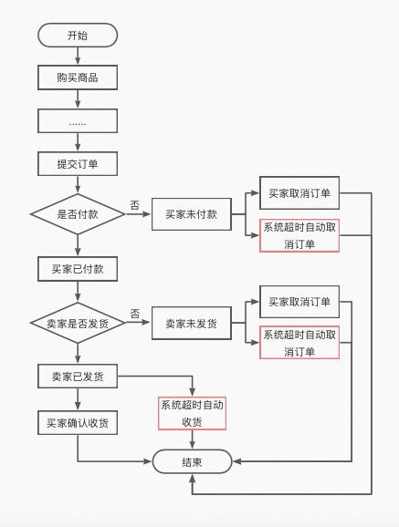

<font style="color:rgb(62, 62, 62);">如上图所示，一个订单流程中有许多环节要用到超时处理，包括但不限于：</font>

+ <font style="color:rgb(62, 62, 62);">买家超时未付款：比如超过15分钟没有支付，订单自动取消。</font>
+ <font style="color:rgb(62, 62, 62);">商家超时未发货：比如商家超过1个月没发货，订单自动取消。</font>
+ <font style="color:rgb(62, 62, 62);">买家超时未收货：比如商家发货后，买家没有在14天内点击确认收货，则系统默认自动收货。</font>

# <font style="color:rgb(34, 34, 34);">一、JDK自带的延时队列</font>
<font style="color:rgb(62, 62, 62);">JDK中提供了一种延迟队列数据结构DelayQueue，其本质是封装了PriorityQueue，可以把元素进行排序。</font>

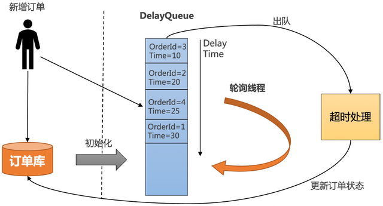

1. <font style="color:rgb(62, 62, 62);">把订单插入DelayQueue中，以超时时间作为排序条件，将订单按照超时时间从小到大排序。</font>
2. <font style="color:rgb(62, 62, 62);">起一个线程不停轮询队列的头部，如果订单的超时时间到了，就出队进行超时处理，并更新订单状态到数据库中。</font>
3. <font style="color:rgb(62, 62, 62);">为了防止机器重启导致内存中的DelayQueue数据丢失，每次机器启动的时候，需要从数据库中初始化未结束的订单，加入到DelayQueue中。</font>
+ <font style="color:rgb(62, 62, 62);">优点：简单，不需要借助其他第三方组件，成本低。</font>
+ <font style="color:rgb(62, 62, 62);">缺点：</font>
    - <font style="color:rgb(62, 62, 62);">所有超时处理订单都要加入到DelayQueue中，占用内存大。</font>
    - <font style="color:rgb(62, 62, 62);">没法做到分布式处理，只能在集群中选一台leader专门处理，效率低。</font>
    - <font style="color:rgb(62, 62, 62);">不适合订单量比较大的场景。</font>

# <font style="color:rgb(34, 34, 34);">二、RabbitMQ的延时消息</font>
<font style="color:rgb(62, 62, 62);">RabbitMQ的延时消息主要有两个解决方案：</font>

+ <font style="color:rgb(62, 62, 62);">RabbitMQ Delayed Message Plugin</font>
+ <font style="color:rgb(62, 62, 62);">消息的TTL+死信Exchange</font>

<font style="color:rgb(62, 62, 62);">RabbitMQ Delayed Message Plugin是官方提供的延时消息插件，虽然使用起来比较方便，但是不是高可用的，如果节点挂了会导致消息丢失。引用官网原文：</font>

<font style="color:rgb(136, 136, 136);">Delayed messages are stored in a Mnesia table (also see Limitations below) with a single disk replica on the current node. They will survive a node restart. While timer(s) that triggered scheduled delivery are not persisted, it will be re-initialised during plugin activation on node start. Obviously, only having one copy of a scheduled message in a cluster means that losing that node or disabling the plugin on it will lose the messages residing on that node.</font>

<font style="color:rgb(62, 62, 62);">消息的TTL+死信Exchange解决方案，先要了解两个概念：</font>

+ <font style="color:rgb(62, 62, 62);">TTL：即消息的存活时间。RabbitMQ可以对队列和消息分别设置TTL，如果对队列设置，则队列中所有的消息都具有相同的过期时间。超过了这个时间，我们认为这个消息就死了，称之为死信。</font>
+ <font style="color:rgb(62, 62, 62);">死信Exchange（DLX）：一个消息在满足以下条件会进入死信交换机</font>
    - <font style="color:rgb(62, 62, 62);">一个消息被Consumer拒收了，并且reject方法的参数里requeue是false。也就是说不会被再次放在队列里，被其他消费者使用。</font>
    - <font style="color:rgb(62, 62, 62);">TTL到期的消息。</font>
    - <font style="color:rgb(62, 62, 62);">队列满了被丢弃的消息。</font>

<font style="color:rgb(62, 62, 62);">一个延时消息的流程如下图：</font>

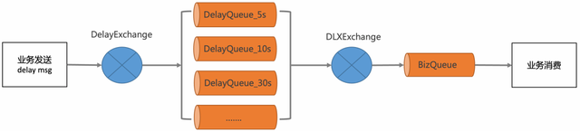

1. <font style="color:rgb(62, 62, 62);">定义一个BizQueue，用来接收死信消息，并进行业务消费。</font>
2. <font style="color:rgb(62, 62, 62);">定义一个死信交换机(DLXExchange)，绑定BizQueue，接收延时队列的消息，并转发给BizQueue。</font>
3. <font style="color:rgb(62, 62, 62);">定义一组延时队列DelayQueue_xx，分别配置不同的TTL，用来处理固定延时5s、10s、30s等延时等级，并绑定到DLXExchange。</font>
4. <font style="color:rgb(62, 62, 62);">定义DelayExchange，用来接收业务发过来的延时消息，并根据延时时间转发到不同的延时队列中。</font>
+ <font style="color:rgb(62, 62, 62);">优点：可以支持海量延时消息，支持分布式处理。</font>
+ <font style="color:rgb(62, 62, 62);">缺点：</font>
    - <font style="color:rgb(62, 62, 62);">不灵活，只能支持固定延时等级。</font>
    - <font style="color:rgb(62, 62, 62);">使用复杂，要配置一堆延时队列。</font>

# <font style="color:rgb(34, 34, 34);">三、RocketMQ的定时消息</font>
<font style="color:rgb(62, 62, 62);">RocketMQ支持任意秒级的定时消息，如下图所示</font>

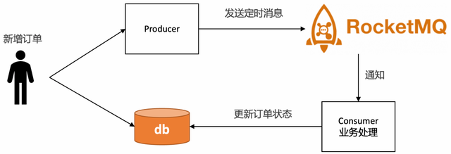

<font style="color:rgb(62, 62, 62);">使用门槛低，只需要在发送消息的时候设置延时时间即可，以java代码为例：</font>

```java
MessageBuilder messageBuilder = null;
//延迟10分钟
Long deliverTimeStamp = System.currentTimeMillis() + 10L * 60 * 1000;  
Message message = messageBuilder.setTopic("topic")        
 .setKeys("messageKey")      //设置消息索引键，可根据关键字精确查找某条消息。               
.setTag("messageTag")        //设置消息Tag，用于消费端根据指定Tag过滤消息。    
.setDeliveryTimestamp(deliverTimeStamp)      //设置延时时间                
.setBody("messageBody".getBytes())     //消息体   
.build();
SendReceipt sendReceipt = producer.send(message);
System.out.println(sendReceipt.getMessageId());
```

**<font style="color:rgb(62, 62, 62);">RocketMQ的定时消息是如何实现的呢？</font>**

<font style="color:rgb(62, 62, 62);">在RocketMQ中，使用了经典的</font><font style="color:rgb(62, 62, 62);">时间轮算法[1]</font><font style="color:rgb(62, 62, 62);">。通过TimerWheel来描述时间轮不同的时刻，通过TimerLog来记录不同时刻的消息。</font>

<font style="color:rgb(62, 62, 62);">TimerWheel中的每一格代表着一个时刻，同时会有一个firstPos指向这个刻度下所有定时消息的首条TimerLog记录的地址，一个lastPos指向这个刻度下所有定时消息最后一条TimerLog的记录的地址。并且，对于所处于同一个刻度的的消息，其TimerLog会通过prevPos串联成一个链表。</font>

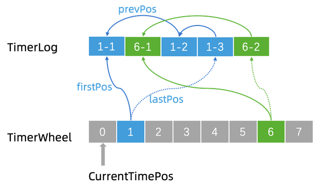

<font style="color:rgb(62, 62, 62);">当需要新增一条记录的时候，例如现在我们要新增一个 “1-4”。那么就将新记录的 prevPos 指向当前的 lastPos，即 “1-3”，然后修改 lastPos 指向 “1-4”。这样就将同一个刻度上面的 TimerLog 记录全都串起来了。</font>

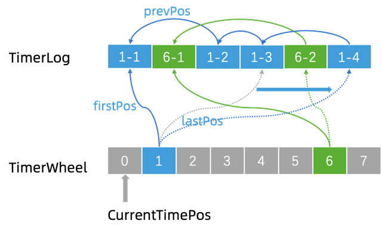

+ <font style="color:rgb(62, 62, 62);">优点</font>
    - <font style="color:rgb(62, 62, 62);">精度高，支持任意时刻。</font>
    - <font style="color:rgb(62, 62, 62);">支持分布式</font>
    - <font style="color:rgb(62, 62, 62);">使用门槛低，和使用普通消息一样。</font>
+ <font style="color:rgb(62, 62, 62);">缺点</font>
    - <font style="color:rgb(62, 62, 62);">使用限制：定时时长最大值24小时。</font>
    - <font style="color:rgb(62, 62, 62);">成本高：每个订单需要新增一个定时消息，且不会马上消费，给MQ带来很大的存储成本。</font>
    - <font style="color:rgb(62, 62, 62);">同一个时刻大量消息会导致消息延迟：定时消息的实现逻辑需要先经过定时存储等待触发，定时时间到达后才会被投递给消费者。因此，如果将大量定时消息的定时时间设置为同一时刻，则到达该时刻后会有大量消息同时需要被处理，会造成系统压力过大，导致消息分发延迟，影响定时精度。</font>

# <font style="color:rgb(34, 34, 34);">四、Redis的过期监听</font>
<font style="color:rgb(62, 62, 62);">Redis支持过期监听，也能达到和RocketMQ定时消息一样的能力，具体步骤如下：</font>

1. <font style="color:rgb(62, 62, 62);">redis配置文件开启"notify-keyspace-events Ex"</font>

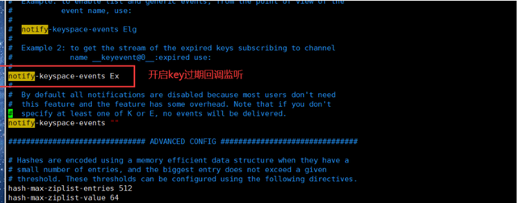

1. <font style="color:rgb(62, 62, 62);">监听key的过期回调，以java代码为例</font>

```plain
@Configurationpublic
class RedisListenerConfig {
    @Bean
    RedisMessageListenerContainer container(RedisConnectionFactory factory) {
        RedisMessageListenerContainer container = new RedisMessageListenerContainer();
        container.setConnectionFactory(factory);

        return container;
    }
}

```

```plain
@Componentpublic
class RedisKeyExpirationListerner extends KeyExpirationEventMessageListener {
    public RedisKeyExpirationListerner(
        RedisMessageListenerContainer listenerContainer) {
        super(listenerContainer);
    }

    @Override
    public void onMessage(Message message, byte[] pattern) {
        String keyExpira = message.toString();
        System.out.println("监听到key：" + expiredKey + "已过期");
    }
}

```

<font style="color:rgb(62, 62, 62);">使用Redis进行订单超时处理的流程图如下</font>

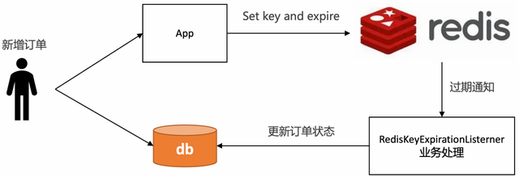

<font style="color:rgb(62, 62, 62);">这个方案表面看起来没问题，但是在实际生产上不推荐，我们来看下Redis过期时间的原理</font>

<font style="color:rgb(62, 62, 62);">每当我们对一个key设置了过期时间，Redis就会把该key带上过期时间，存到过期字典中，在redisDb中通过expires字段维护：</font>

```plain
typedef struct redisDb {   
 dict *dict;    /* 维护所有key-value键值对 */  
 dict *expires; /* 过期字典，维护设置失效时间的键 */   
 ....
} 
redisDb;
```

<font style="color:rgb(62, 62, 62);">过期字典本质上是一个链表，每个节点的数据结构结构如下：</font>

+ <font style="color:rgb(62, 62, 62);">key是一个指针，指向某个键对象。</font>
+ <font style="color:rgb(62, 62, 62);">value是一个long long类型的整数，保存了key的过期时间。</font>

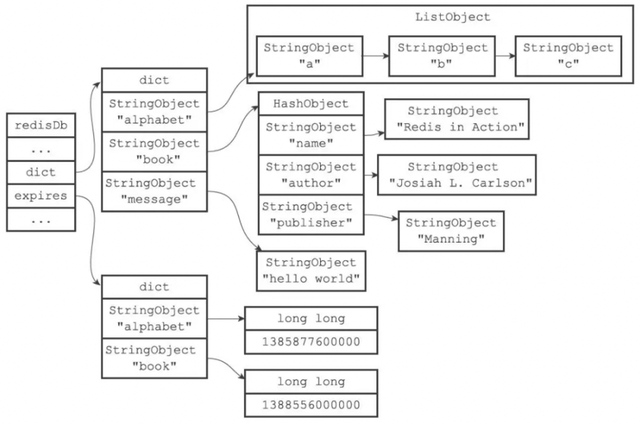

<font style="color:rgb(62, 62, 62);">Redis主要使用了定期删除和惰性删除策略来进行过期key的删除</font>

+ <font style="color:rgb(62, 62, 62);">定期删除：每隔一段时间（默认100ms）就</font>**<font style="color:rgb(62, 62, 62);">随机抽取</font>**<font style="color:rgb(62, 62, 62);">一些设置了过期时间的key，检查其是否过期，如果有过期就删除。之所以这么做，是为了通过限制删除操作的执行时长和频率来减少对cpu的影响。不然每隔100ms就要遍历所有设置过期时间的key，会导致cpu负载太大。</font>
+ <font style="color:rgb(62, 62, 62);">惰性删除：不主动删除过期的key，每次从数据库访问key时，都检测key是否过期，如果过期则删除该key。惰性删除有一个问题，如果这个key已经过期了，但是一直没有被访问，就会一直保存在数据库中。</font>

<font style="color:rgb(62, 62, 62);">从以上的原理可以得知[2]，Redis过期删除是不精准的，在订单超时处理的场景下，惰性删除基本上也用不到，无法保证key在过期的时候可以立即删除，更不能保证能立即通知。如果订单量比较大，那么延迟几分钟也是有可能的。</font>

<font style="color:rgb(62, 62, 62);">Redis过期通知也是不可靠的</font><font style="color:rgb(62, 62, 62);">，Redis在过期通知的时候，如果应用正好重启了，那么就有可能通知事件就丢了，会导致订单一直无法关闭，有稳定性问题。如果一定要使用Redis过期监听方案，建议再通过定时任务做补偿机制。</font>

# <font style="color:rgb(34, 34, 34);">五、定时任务分布式批处理</font>
<font style="color:rgb(62, 62, 62);">定时任务分布式批处理解决方案，即通过定时任务不停轮询数据库的订单，将已经超时的订单捞出来，分发给不同的机器分布式处理：</font>

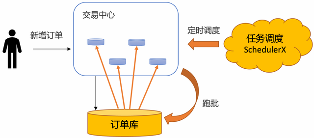

<font style="color:rgb(62, 62, 62);">使用定时任务分布式批处理的方案具有如下优势：</font>

+ **<font style="color:rgb(62, 62, 62);">稳定性强：</font>**<font style="color:rgb(62, 62, 62);">基于通知的方案（比如MQ和Redis），比较担心在各种极端情况下导致通知的事件丢了。使用定时任务跑批，只需要保证业务幂等即可，如果这个批次有些订单没有捞出来，或者处理订单的时候应用重启了，下一个批次还是可以捞出来处理，稳定性非常高。</font>
+ **<font style="color:rgb(62, 62, 62);">效率高：</font>**<font style="color:rgb(62, 62, 62);">基于MQ的方案，需要一个订单一个定时消息，consumer处理定时消息的时候也需要一个订单一个订单更新，对数据库tps很高。使用定时任务跑批方案，一次捞出一批订单，处理完了，可以批量更新订单状态，减少数据库的tps。在海量订单处理场景下，批量处理效率最高。</font>
+ **<font style="color:rgb(62, 62, 62);">可运维：</font>**<font style="color:rgb(62, 62, 62);">基于数据库存储，可以很方便的对订单进行修改、暂停、取消等操作，所见即所得。如果业务跑失败了，还可以直接通过sql修改数据库来进行批量运维。</font>
+ **<font style="color:rgb(62, 62, 62);">成本低：</font>**<font style="color:rgb(62, 62, 62);">相对于其他解决方案要借助第三方存储组件，复用数据库的成本大大降低。</font>

<font style="color:rgb(62, 62, 62);">但是使用定时任务有个天然的缺点：没法做到精度很高。定时任务的延迟时间，由定时任务的调度周期决定。如果把频率设置很小，就会导致数据库的qps比较高，容易造成数据库压力过大，从而影响线上的正常业务。</font>

<font style="color:rgb(62, 62, 62);">所以一般需要抽离出超时中心和超时库来单独做订单的超时调度，在阿里内部，几乎所有的业务都使用</font>**<font style="color:rgb(62, 62, 62);">基于定时任务分布式批处理的超时中心来做订单超时处理</font>**<font style="color:rgb(62, 62, 62);">，SLA可以做到30秒以内：</font>

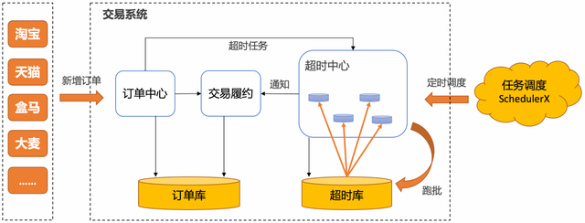

<font style="color:rgb(62, 62, 62);">如何让超时中心不同的节点协同工作，拉取不同的数据？</font>

<font style="color:rgb(62, 62, 62);">通常的解决方案是借助任务调度系统，开源任务调度系统大多支持分片模型，比较适合做分库分表的轮询，比如一个分片代表一张分表。但是如果分表特别多，分片模型配置起来还是比较麻烦的。另外如果只有一张大表，或者超时中心使用其他的存储，这两个模型就不太适合。</font>

<font style="color:rgb(62, 62, 62);">阿里巴巴分布式任务调度系统SchedulerX[3]</font><font style="color:rgb(62, 62, 62);">，不但兼容主流开源任务调度系统和Spring @Scheduled注解，还自研了</font><font style="color:rgb(62, 62, 62);">轻量级MapReduce模型[4]</font><font style="color:rgb(62, 62, 62);">，针对任意异构数据源，简单几行代码就可以实现海量数据秒级别跑批。</font>

1. <font style="color:rgb(62, 62, 62);">通过实现map函数，通过代码自行构造分片，SchedulerX会将分片平均分给超时中心的不同节点分布式执行。</font>

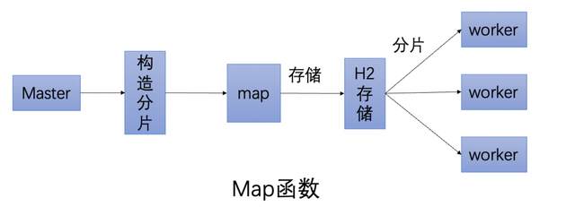

1. <font style="color:rgb(62, 62, 62);">通过实现reduce函数，可以做聚合，可以判断这次跑批有哪些分片跑失败了，从而通知下游处理。</font>

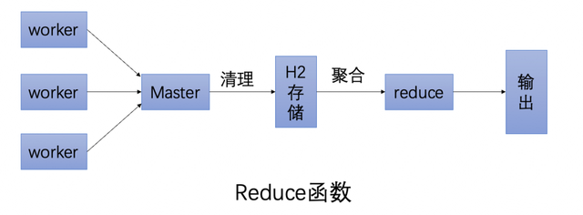

<font style="color:rgb(62, 62, 62);">使用SchedulerX定时跑批解决方案，还具有如下优势：</font>

+ **<font style="color:rgb(62, 62, 62);">免运维、成本低：</font>**<font style="color:rgb(62, 62, 62);">不需要自建任务调度系统，由云上托管。</font>
+ **<font style="color:rgb(62, 62, 62);">可观测：</font>**<font style="color:rgb(62, 62, 62);">提供任务执行的历史记录、查看堆栈、日志服务、链路追踪等能力。</font>
+ **<font style="color:rgb(62, 62, 62);">高可用：</font>**<font style="color:rgb(62, 62, 62);">支持同城双活容灾，支持多种渠道的监控报警。</font>
+ **<font style="color:rgb(62, 62, 62);">混部：</font>**<font style="color:rgb(62, 62, 62);">可以托管阿里云的机器，也可以托管非阿里云的机器。</font>

# <font style="color:rgb(34, 34, 34);">总结</font>
<font style="color:rgb(62, 62, 62);">如果对于超时精度比较高，超时时间在24小时内，且不会有峰值压力的场景，推荐使用RocketMQ的定时消息解决方案。</font>

<font style="color:rgb(62, 62, 62);">在电商业务下，许多订单超时场景都在24小时以上，对于超时精度没有那么敏感，并且有海量订单需要批处理，推荐使用基于定时任务的跑批解决方案。</font>

**<font style="color:rgb(62, 62, 62);">参考链接：</font>**<font style="color:rgb(62, 62, 62);"></font>

<font style="color:rgb(62, 62, 62);">[1]https://developer.aliyun.com/article/994932</font>

<font style="color:rgb(62, 62, 62);">[2]https://redis.io/docs/manual/keyspace-notifications/</font>

<font style="color:rgb(62, 62, 62);">[3]https://www.aliyun.com/aliware/schedulerx</font>

<font style="color:rgb(62, 62, 62);">[4]https://developer.aliyun.com/article/706820</font>


> 更新: 2025-03-18 15:28:35  
> 原文: <https://www.yuque.com/u12222632/as5rgl/oqrmvr42y9o36fxz>