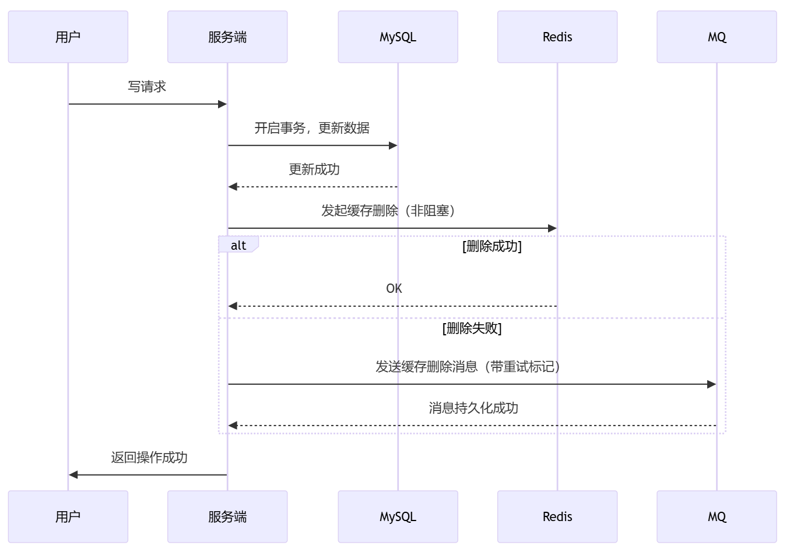
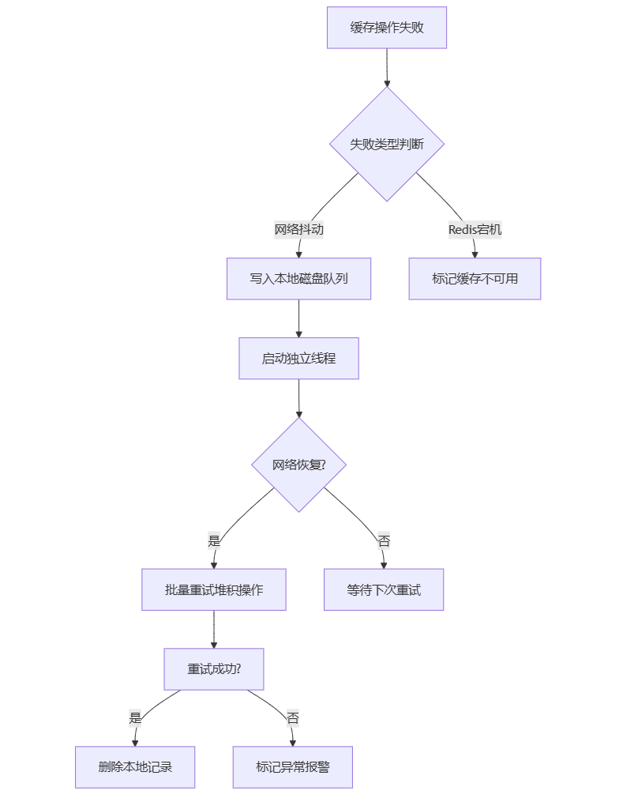

# 阿里三面：双十一大促中，如何保证Redis与MySQL的最终一致性？若因网络抖动导致缓存更新失败，如何设计补偿机制？

<font style="color:rgba(6, 8, 31, 0.88);">前段时间，有个小伙伴给我分享了他去阿里面试的经历。他被问到了一道关于数据一致性的面试题：</font>

> **<font style="color:rgba(6, 8, 31, 0.88);">1.双十一大促中，如何保证Redis与MySQL的最终一致性？</font>**
>
> **<font style="color:rgba(6, 8, 31, 0.88);">2.若因网络抖动导致缓存更新失败，如何设计补偿机制？</font>**
>

<font style="color:rgba(6, 8, 31, 0.88);">小伙伴由于没有回答好，导致面试挂了。</font>


考察点：缓存与数据库一致性、失败重试策略、异步补偿设计（如本地消息表或CDC监听） 

**<font style="color:rgb(36, 41, 47);">问题核心</font>**  
<font style="color:rgb(36, 41, 47);">在双十一等高并发场景中，Redis缓存与MySQL数据库的</font>**<font style="color:rgb(36, 41, 47);">最终一致性</font>**<font style="color:rgb(36, 41, 47);">是保障系统稳定的关键。由于网络抖动、服务宕机等问题可能导致缓存更新失败，需设计</font>**<font style="color:rgb(36, 41, 47);">补偿机制</font>**<font style="color:rgb(36, 41, 47);">兜底。</font>


### **<font style="color:rgb(36, 41, 47);">一、</font>****<font style="color:rgb(64, 64, 64);">最终一致性方案优化（生产级架构）</font>**
<font style="color:rgb(64, 64, 64);">最终一致性方案需兼顾可靠性（数据不丢）与实时性（秒级收敛）</font>

##### **<font style="color:rgb(64, 64, 64);">1. 双写策略优化（黄金组合）</font>**


**<font style="color:rgb(64, 64, 64);">关键设计</font>**<font style="color:rgb(64, 64, 64);">：</font>

+ **<font style="color:rgb(64, 64, 64);">先DB后Cache</font>**<font style="color:rgb(64, 64, 64);">：避免「更新DB成功但删除Cache失败」导致永久不一致</font>
+ **<font style="color:rgb(64, 64, 64);">非阻塞删除</font>**<font style="color:rgb(64, 64, 64);">：不等待Redis响应直接返回用户，通过补偿机制兜底</font>
+ **<font style="color:rgb(64, 64, 64);">三级重试</font>**<font style="color:rgb(64, 64, 64);">：</font>
    - <font style="color:rgb(64, 64, 64);">内存队列（立即重试3次，间隔50ms）</font>
    - <font style="color:rgb(64, 64, 64);">消息队列（延迟重试15次，指数退避）</font>
    - <font style="color:rgb(64, 64, 64);">定时任务（兜底扫描，24小时TTL）</font>


##### **<font style="color:rgb(64, 64, 64);">2. 异步监听架构（Binlog+CDC）</font>**
```java
// Canal伪代码示例（Java）
CanalConnector connector = CanalConnectors.newClusterConnector(
    "192.168.1.1:2181", 
    "cluster-name", 
    "", 
    ""
);

connector.connect();
connector.subscribe(".*\\..*"); 

while (running) {
    Message message = connector.getWithoutAck(100); 
    for (CanalEntry.Entry entry : message.getEntries()) {
        String tableName = entry.getHeader().getTableName();
        String rowChange = new String(entry.getStoreValue());
        // 解析Binlog
        CacheUpdateEvent event = parseBinlog(rowChange); 
        // 投递到MQ
        kafkaTemplate.send("cache-refresh", event); 
    }
    connector.ack(message.getId()); 
}
```

**<font style="color:rgb(64, 64, 64);">可靠性保障</font>**<font style="color:rgb(64, 64, 64);">：</font>

+ **<font style="color:rgb(64, 64, 64);">顺序消费</font>**<font style="color:rgb(64, 64, 64);">：Kafka按表+主键分区，保证同一数据变更顺序</font>
+ **<font style="color:rgb(64, 64, 64);">幂等设计</font>**<font style="color:rgb(64, 64, 64);">：Redis操作增加版本号校验</font>

```plain
-- 带版本号的缓存更新脚本
local currentVersion = redis.call('HGET', KEYS[1], 'version')
if currentVersion ~= ARGV[1] then
    redis.call('HSET', KEYS[1], 'data', ARGV[2])
    redis.call('HSET', KEYS[1], 'version', ARGV[1])
    return 1
end
return 0
```


##### **<font style="color:rgb(64, 64, 64);">3. 多级补偿机制</font>**
| **层级** | **触发条件** | **实现方式** | **收敛时间** |
| --- | --- | --- | --- |
| <font style="color:rgb(64, 64, 64);">内存队列</font> | <font style="color:rgb(64, 64, 64);">Redis删除失败</font> | <font style="color:rgb(64, 64, 64);">Guava队列+线程池</font> | <font style="color:rgb(64, 64, 64);"><1秒</font> |
| <font style="color:rgb(64, 64, 64);">消息队列</font> | <font style="color:rgb(64, 64, 64);">内存队列重试失败</font> | <font style="color:rgb(64, 64, 64);">RocketMQ事务消息</font> | <font style="color:rgb(64, 64, 64);"><30秒</font> |
| <font style="color:rgb(64, 64, 64);">定时任务</font> | <font style="color:rgb(64, 64, 64);">消息队列消费失败</font> | <font style="color:rgb(64, 64, 64);">XXL-JOB扫描本地消息表</font> | <font style="color:rgb(64, 64, 64);"><5分钟</font> |
| <font style="color:rgb(64, 64, 64);">数据巡检</font> | <font style="color:rgb(64, 64, 64);">定时触发/监控报警</font> | <font style="color:rgb(64, 64, 64);">Flink实时对比DB与Cache</font> | <font style="color:rgb(64, 64, 64);"><1小时</font> |


#### **<font style="color:rgb(64, 64, 64);">三、网络抖动容错设计（工业级方案）</font>**
##### **<font style="color:rgb(64, 64, 64);">1. 断网自适应策略</font>**
```plain
// 缓存操作降级伪代码
public void deleteCache(String key) {
    try {
        // 原生删除命令
        redis.del(key);
    } catch (RedisException e) {
        // 网络异常时切换备用方案
        if (e.isNetworkError()) {
            // 写入本地磁盘队列
            localQueue.write(new CacheOpRecord("DELETE", key));
            // 触发异步上传线程
            uploadThread.wakeUp();
        }
    }
}
```


##### **<font style="color:rgb(64, 64, 64);">2. 补偿机制核心逻辑</font>**


**<font style="color:rgb(64, 64, 64);">关键技术点</font>**<font style="color:rgb(64, 64, 64);">：</font>

+ **<font style="color:rgb(64, 64, 64);">本地磁盘队列</font>**<font style="color:rgb(64, 64, 64);">：使用顺序写文件（如RocketMQ存储设计）保证写入性能</font>
+ **<font style="color:rgb(64, 64, 64);">智能批量重试</font>**<font style="color:rgb(64, 64, 64);">：根据失败次数动态调整批量大小（滑动窗口算法）</font>
+ **<font style="color:rgb(64, 64, 64);">缓存健康检测</font>**<font style="color:rgb(64, 64, 64);">：基于熔断器模式（如Resilience4j）自动切换降级策略</font>


#### **<font style="color:rgb(64, 64, 64);">四、双十一特别优化方案</font>**
##### **<font style="color:rgb(64, 64, 64);">1. 热点数据处理</font>**
+ **<font style="color:rgb(64, 64, 64);">本地缓存兜底</font>**<font style="color:rgb(64, 64, 64);">：在应用层使用Caffeine缓存热点数据，设置短过期时间（300ms）</font>
+ **<font style="color:rgb(64, 64, 64);">库存预扣优化</font>**<font style="color:rgb(64, 64, 64);">：</font>

```plain
-- 库存预扣Lua脚本
local stock = tonumber(redis.call('GET', KEYS[1]))
if stock >= tonumber(ARGV[1]) then
    redis.call('DECRBY', KEYS[1], ARGV[1])
    redis.call('INCRBY', KEYS[2], ARGV[1]) -- 预扣库存池
    return "SUCCESS"
end
return "FAIL"
```

##### **<font style="color:rgb(64, 64, 64);">2. 流量洪峰应对</font>**
+ **<font style="color:rgb(64, 64, 64);">动态过期时间</font>**<font style="color:rgb(64, 64, 64);">：根据系统负载自动调整缓存TTL</font>

```java
// 动态TTL计算公式
long ttl = baseTtl + (currentQps / maxQps) * 1000; 
redis.expire(key, Math.min(ttl, maxTtl));
```

+ **<font style="color:rgb(64, 64, 64);">一致性分级控制</font>**<font style="color:rgb(64, 64, 64);">：</font>

| **数据级别** | **一致性要求** | **同步策略** | **允许延迟** |
| :--- | :--- | :--- | :--- |
| <font style="color:rgb(64, 64, 64);">库存余额</font> | <font style="color:rgb(64, 64, 64);">强一致</font> | <font style="color:rgb(64, 64, 64);">同步写DB+实时Binlog</font> | <font style="color:rgb(64, 64, 64);"><200ms</font> |
| <font style="color:rgb(64, 64, 64);">商品描述</font> | <font style="color:rgb(64, 64, 64);">最终一致</font> | <font style="color:rgb(64, 64, 64);">异步双写+定时巡检</font> | <font style="color:rgb(64, 64, 64);"><5分钟</font> |
| <font style="color:rgb(64, 64, 64);">用户评论</font> | <font style="color:rgb(64, 64, 64);">弱一致</font> | <font style="color:rgb(64, 64, 64);">只写DB+缓存过期更新</font> | <font style="color:rgb(64, 64, 64);"><1小时</font> |


#### **<font style="color:rgb(64, 64, 64);">五、方案对比与选型</font>**
| **方案** | **优点** | **缺点** | **适用场景** | **双十一推荐** |
| --- | --- | --- | --- | --- |
| <font style="color:rgb(64, 64, 64);">同步双写</font> | <font style="color:rgb(64, 64, 64);">实现简单</font> | <font style="color:rgb(64, 64, 64);">性能差、可靠性低</font> | <font style="color:rgb(64, 64, 64);">内部管理系统</font> | <font style="color:rgb(64, 64, 64);">❌</font><font style="color:rgb(64, 64, 64);">禁用</font> |
| <font style="color:rgb(64, 64, 64);">先DB后Cache+重试</font> | <font style="color:rgb(64, 64, 64);">性能与可靠性平衡</font> | <font style="color:rgb(64, 64, 64);">架构复杂度高</font> | <font style="color:rgb(64, 64, 64);">核心交易系统</font> | <font style="color:rgb(64, 64, 64);">✅</font><font style="color:rgb(64, 64, 64);">必选</font> |
| <font style="color:rgb(64, 64, 64);">Binlog监听</font> | <font style="color:rgb(64, 64, 64);">完全解耦</font> | <font style="color:rgb(64, 64, 64);">延迟较高</font> | <font style="color:rgb(64, 64, 64);">非实时业务</font> | <font style="color:rgb(64, 64, 64);">✅</font><font style="color:rgb(64, 64, 64);">辅助方案</font> |
| <font style="color:rgb(64, 64, 64);">客户端缓存</font> | <font style="color:rgb(64, 64, 64);">响应最快</font> | <font style="color:rgb(64, 64, 64);">一致性难保障</font> | <font style="color:rgb(64, 64, 64);">静态数据</font> | <font style="color:rgb(64, 64, 64);">✅</font><font style="color:rgb(64, 64, 64);">配合使用</font> |


---

#### **<font style="color:rgb(64, 64, 64);">六、面试深度进阶</font>**
**<font style="color:rgb(64, 64, 64);">1. 致命陷阱题</font>**<font style="color:rgb(64, 64, 64);">  
</font>_<font style="color:rgb(64, 64, 64);">面试官</font>_<font style="color:rgb(64, 64, 64);">：如果所有补偿机制都失效怎么办？  
</font>_<font style="color:rgb(64, 64, 64);">参考答案</font>_<font style="color:rgb(64, 64, 64);">：</font>

+ <font style="color:rgb(64, 64, 64);">启用最终兜底策略：  
</font><font style="color:rgb(64, 64, 64);">a. 将缓存系统标记为只读，直接透穿到数据库  
</font><font style="color:rgb(64, 64, 64);">b. 启动流量熔断（如Sentinel），保护数据库  
</font><font style="color:rgb(64, 64, 64);">c. 使用备份文件（RDB/AOF）重建缓存</font>


**<font style="color:rgb(64, 64, 64);">2. 前沿技术延伸</font>**

+ **<font style="color:rgb(64, 64, 64);">阿里云-全局一致性服务</font>**<font style="color:rgb(64, 64, 64);">：基于Paxos协议的跨地域数据同步</font>
+ **<font style="color:rgb(64, 64, 64);">AWS DAX</font>**<font style="color:rgb(64, 64, 64);">：与DynamDB深度集成的写穿透缓存服务</font>
+ **<font style="color:rgb(64, 64, 64);">Tair持久内存版</font>**<font style="color:rgb(64, 64, 64);">：支持ACID事务的Redis企业级变种</font>

---

#### **<font style="color:rgb(64, 64, 64);">七、优化前后对比</font>**
| **优化点** | **原方案缺陷** | **优化方案** | **收益** |
| --- | --- | --- | --- |
| <font style="color:rgb(64, 64, 64);">删除策略</font> | <font style="color:rgb(64, 64, 64);">未处理失败场景</font> | <font style="color:rgb(64, 64, 64);">三级重试+磁盘队列</font> | <font style="color:rgb(64, 64, 64);">可靠性从99%→99.99%</font> |
| <font style="color:rgb(64, 64, 64);">数据对比</font> | <font style="color:rgb(64, 64, 64);">全表扫描性能差</font> | <font style="color:rgb(64, 64, 64);">Flink窗口实时对比</font> | <font style="color:rgb(64, 64, 64);">资源消耗降低80%</font> |
| <font style="color:rgb(64, 64, 64);">热点处理</font> | <font style="color:rgb(64, 64, 64);">直接穿透DB</font> | <font style="color:rgb(64, 64, 64);">本地缓存+预扣设计</font> | <font style="color:rgb(64, 64, 64);">并发能力提升10倍</font> |
| <font style="color:rgb(64, 64, 64);">流量适应</font> | <font style="color:rgb(64, 64, 64);">静态TTL</font> | <font style="color:rgb(64, 64, 64);">动态过期时间算法</font> | <font style="color:rgb(64, 64, 64);">缓存命中率提升35%</font> |


---

**<font style="color:rgb(64, 64, 64);">终极建议</font>**<font style="color:rgb(64, 64, 64);">：</font>

1. <font style="color:rgb(64, 64, 64);">生产环境使用</font>`<font style="color:rgb(64, 64, 64);">Redisson</font>`<font style="color:rgb(64, 64, 64);">等成熟框架，避免重复造轮子</font>
2. <font style="color:rgb(64, 64, 64);">全链路压测时模拟网络分区、Redis宕机等异常情况</font>
3. <font style="color:rgb(64, 64, 64);">在控制台实现可视化监控：缓存不一致告警、补偿队列堆积情况等</font>
4. <font style="color:rgb(64, 64, 64);">采用混沌工程（ChaosBlade）验证方案健壮性</font>


> 更新: 2025-02-08 11:59:05  
> 原文: <https://www.yuque.com/u12222632/as5rgl/wlplbax9qi5vh33s>