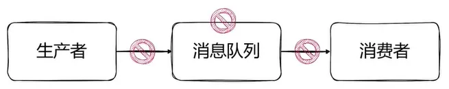
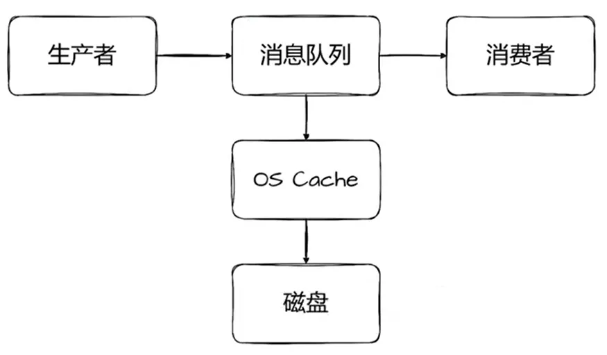
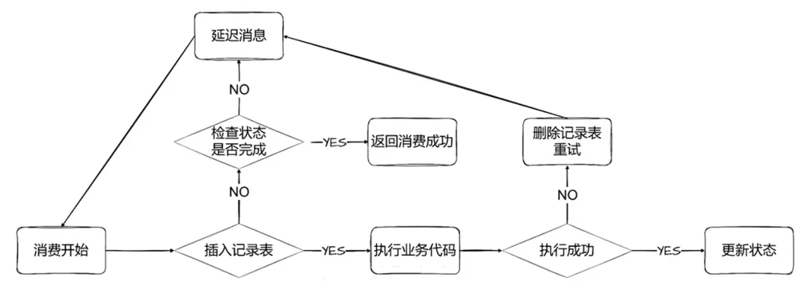

# 阿里二面：在高并发场景下如何保证消息只被消费一次？

****

首先，我们需要明确的是，无论是否处于高并发场景，确保消息仅被消费一次都是一个核心需求。这一需求的核心在于，我们必须防止消息在传输和消费过程中丢失，同时避免消息被重复消费。

接下来，我们将深入剖析消息从生产到消费的整个链路，并识别出可能导致消息丢失或重复消费的环节。

  

这些环节主要包括：

  

## 一、生产者发送消息至消息队列环节
生产者发送消息至消息队列环节是确保消息传递完整性的关键一步。为了保证消息不丢失，需要采取一系列措施，并了解可能导致消息丢失的原因。

### 可能导致消息丢失的原因
1. **网络故障**：
    - 网络不稳定或中断可能导致生产者无法将消息成功发送到Broker。
    - 网络延迟或丢包也可能导致消息在传输过程中丢失。
2. **生产者错误**：
    - 生产者配置错误或代码错误可能导致消息发送失败。
    - 例如，如果生产者发送消息到错误的Topic或队列，消息将无法被正确处理。
3. **Broker故障**：
    - 如果Broker宕机或进程崩溃，可能导致正在处理的消息丢失。
    - 集群部署的Broker如果未配置多副本机制，当某个节点故障时，可能导致该节点上的消息丢失。
4. **消息过大**：
    - 如果消息的大小超过了Broker的限制，消息可能会被丢弃。
    - 在发送大消息之前，生产者应检查消息大小，并根据需要进行拆分或压缩。
    -   

### 该环节保证消息不丢失的措施
1. **请求确认机制（ACK）**：
    - 生产者发送消息给Broker后，Broker如果成功接收到消息，会返回一个确认响应（ACK）给生产者。
    - 生产者收到ACK后，确认消息已经被Broker成功接收，从而确保发送阶段消息不会丢失。
    - 如果生产者超时等待未收到ACK，则需要重试发送消息。重试机制应设定合理的次数，避免无限重试导致的系统阻塞。例如，RocketMQ默认重试3次失败后返回错误或直接抛出异常，此时需要人工介入处理。
2. **处理异常和返回值**：
    - 在发送消息时，生产者应妥善处理Broker返回的异常和错误码。
    - 如果发送失败，生产者需要记录错误信息，并根据业务需求决定是否重新发送消息或采取其他补偿措施。
3. **网络稳定性**：
    - 在发送消息之前，生产者应检查网络连接状态，确保网络连接稳定可靠。
    - 使用网络监控工具和技术手段，及时发现并解决网络故障，以减少因网络问题导致的消息丢失。

  

## 二、消息队列存储消息环节
在这一环节，消息队列的刷盘机制是关键。为了避免消息丢失，我们应配置消息队列使用同步刷盘机制，即消息在同步到磁盘后才返回ACK给生产者。这样可以确保即使消息队列出现重启，消息也不会丢失。

  

消息队列的刷盘机制是指将数据从内存写入磁盘的过程，这是确保消息持久化和系统可靠性的关键。

  

以下是对消息队列刷盘机制的详细解释：

消息队列中的刷盘机制主要用于保证消息的可靠性。在消息队列系统中，消息首先被保存在内存中，然后通过刷盘机制将消息持久化到磁盘，以防止数据丢失。这样，即使系统崩溃或重启，已经持久化的消息仍然可以被恢复和重新处理。

  
消息队列系统通常支持多种刷盘模式，以适应不同的应用场景和需求。以下是两种常见的刷盘模式：

1. **同步刷盘**：
    - **原理**：在同步刷盘模式下，每次消息写入都会等待消息从内存刷写到磁盘后才返回成功响应。
    - **特点**：数据可靠性高，因为消息的持久化在物理磁盘上完成，确保消息不丢失。但性能较低，因为每次写操作都需要等待磁盘IO，写入延迟较高，吞吐量较低。
    - **适用场景**：适用于对数据一致性要求极高的场景，如金融、银行、交易系统等。
2. **异步刷盘**：
    - **原理**：在异步刷盘模式下，消息写入内存缓冲区后立即返回成功响应，刷盘操作在后台异步进行。
    - **特点**：性能高，因为消息写入后立即返回成功响应，刷盘操作在后台异步进行，写入延迟低，吞吐量高。但数据可靠性较低，因为在系统崩溃时，内存中的未刷盘数据可能丢失。
    - **适用场景**：适用于对性能和吞吐量要求较高的场景，如互联网应用、大数据处理等。

不同的消息队列系统可能有不同的刷盘机制实现方式。以RocketMQ为例，其刷盘机制的实现包括以下几个关键部分：

1. **CommitLog文件系统**：RocketMQ使用CommitLog文件系统来管理消息的存储。消息首先被写入内存缓冲区（PageCache），然后根据刷盘策略，将消息从内存缓冲区刷入磁盘上的CommitLog文件。
2. **刷盘线程**：RocketMQ有专门的刷盘线程负责将内存中的数据刷写到磁盘。在同步刷盘模式下，刷盘线程会等待消息写入磁盘后才返回成功响应；在异步刷盘模式下，刷盘线程在后台异步进行刷盘操作。
3. **持久化存储**：RocketMQ通过刷盘机制将消息持久化到磁盘上，以确保消息的可靠性。即使系统崩溃或重启，已经持久化的消息仍然可以被恢复和重新处理。

  
为了提高刷盘机制的效率和可靠性，可以采取以下优化措施：

1. **选择合适的刷盘模式**：根据实际业务需求选择合适的刷盘模式。对数据一致性要求极高的场景选择同步刷盘；对性能和吞吐量要求较高的场景选择异步刷盘。
2. **优化磁盘IO性能**：使用高性能的磁盘和文件系统，提高磁盘IO性能，从而加快刷盘速度。
3. **合理配置刷盘策略**：根据系统负载和性能要求，合理配置刷盘策略，如设置刷盘间隔、刷盘阈值等。

  
三、消费者拉取并消费消息

在这一环节，消费者可能出现宕机或消费失败的情况，导致消息未能被正确消费。为了确保消息仅被消费一次，我们可以采取以下策略：

消费者可以通过使用记录表（例如数据库表或缓存系统）来跟踪已处理的消息。以下是一个详细的流程，描述了如何通过记录表保证消息只被消费一次：

    - **消息接收**：
        * 消费者从消息队列中接收消息。这通常涉及到一个拉取（pull）或推送（push）机制，具体取决于消息队列的实现。
    - **检查记录表**：
        * 在处理消息之前，消费者首先检查一个记录表（如数据库表或Redis集合），以确定该消息是否已经被处理过。
        * 记录表中通常包含消息的唯一标识符（如消息ID）和状态（如“已处理”或“未处理”）。
    - **处理消息**：
        * 如果记录表显示该消息尚未被处理，消费者则继续处理该消息。
        * 处理过程可能涉及业务逻辑的执行、数据的更新或存储等。
    - **更新记录表**：
        * 一旦消息被成功处理，消费者将更新记录表，将该消息的状态标记为“已处理”。
    - **异常处理**：
        * 如果在处理消息过程中发生异常或错误，消费者可能需要将消息重新放回队列或将其标记为失败，以便后续处理。
        * 在这种情况下，记录表的状态可能需要相应地更新，以反映消息的处理状态。
    - **幂等性设计**：
        * 为了确保即使消息被重复处理也不会导致错误，消费者的处理逻辑应该是幂等的。
        * 幂等性意味着无论消息被处理多少次，结果都应该是相同的。
    - **死信队列**：
        * 对于多次处理失败的消息，可以考虑将其发送到死信队列（Dead-letter Queue, DLQ）中。
        * 死信队列允许开发者对无法处理的消息进行后续分析和处理。
    - **监控和报警**：
        * 监控记录表和消息队列的状态，以及消费者的处理性能。
        * 设置报警机制，以便在出现异常或延迟时及时通知相关人员。
        *   

此外，我们还需要注意以下几点：

+ **性能与可靠性的平衡**：虽然同步刷盘机制可以提高消息的可靠性，但可能会降低系统的性能。因此，在实际应用中，我们需要根据业务需求和系统性能进行权衡。
+ **技术选型与实现**：在选择消息队列和记录表等技术组件时，我们需要考虑其可靠性、性能和可扩展性等因素。同时，在实现过程中，我们需要注意代码的健壮性和异常处理机制。

> 更新: 2025-03-10 12:57:49  
> 原文: <https://www.yuque.com/u12222632/as5rgl/qxhvxbrrl8wd4yzk>