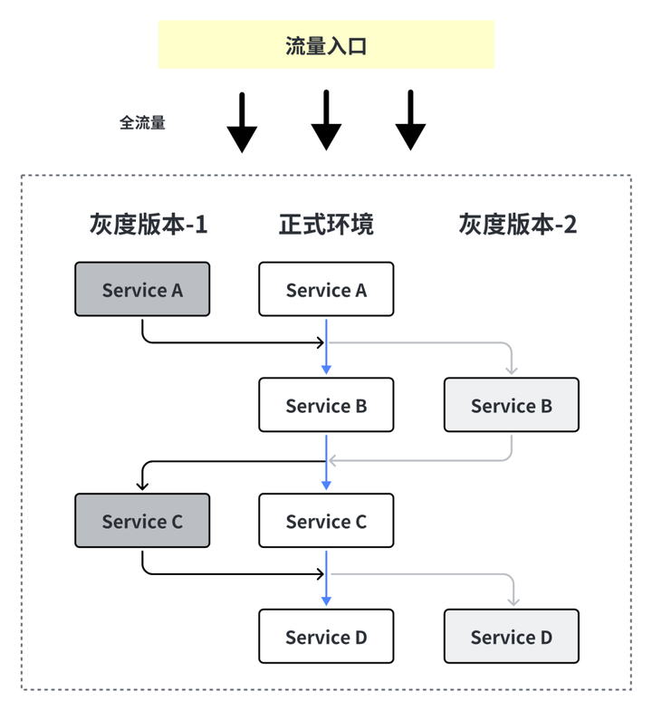

# 阿里二面：基于Spring Cloud Alibaba的微服务架构，如何实现全链路灰度发布？

### **<font style="color:rgb(36, 41, 47);"></font>**
**<font style="color:rgb(36, 41, 47);">考察点</font>**<font style="color:rgb(36, 41, 47);">：微服务治理能力、配置中心动态规则、灰度发布与流量染色技术</font>

<font style="color:rgb(36, 41, 47);"></font>

### **<font style="color:rgb(36, 41, 47);">一、全链路灰度发布的原理与挑战</font>**
<font style="color:rgb(36, 41, 47);">灰度发布的核心目标是</font>**<font style="color:rgb(36, 41, 47);">将新版本服务逐步暴露给特定用户或流量</font>**<font style="color:rgb(36, 41, 47);">，验证稳定后再全量上线。在微服务架构中，全链路灰度需要解决以下问题：</font>

1. **<font style="color:rgb(36, 41, 47);">流量染色</font>**<font style="color:rgb(36, 41, 47);">：在入口标识灰度流量（如通过Header、Cookie、用户ID等）</font><font style="color:rgb(36, 41, 47);">。</font>
2. **<font style="color:rgb(36, 41, 47);">标记透传</font>**<font style="color:rgb(36, 41, 47);">：确保灰度标记在服务间调用（如OpenFeign、RestTemplate）中透传</font><font style="color:rgb(36, 41, 47);">。</font>
3. **<font style="color:rgb(36, 41, 47);">动态路由</font>**<font style="color:rgb(36, 41, 47);">：根据标记将请求路由到灰度或稳定版本的服务实例</font><font style="color:rgb(36, 41, 47);">。</font>

**<font style="color:rgb(36, 41, 47);">技术难点</font>**<font style="color:rgb(36, 41, 47);">：</font>

+ **<font style="color:rgb(36, 41, 47);">环境隔离</font>**<font style="color:rgb(36, 41, 47);">：需区分灰度与非灰度的服务实例（通常通过Nacos元数据标记）。</font>
+ **<font style="color:rgb(36, 41, 47);">规则动态生效</font>**<font style="color:rgb(36, 41, 47);">：灰度策略需支持热更新（如Nacos配置中心）</font>

### 
### **<font style="color:rgb(36, 41, 47);">二、实现全链路灰度的核心步骤</font>**
#### **<font style="color:rgb(36, 41, 47);">1. 服务注册与元数据标记</font>**
<font style="color:rgb(36, 41, 47);">使用</font>**<font style="color:rgb(36, 41, 47);">Nacos</font>**<font style="color:rgb(36, 41, 47);">作为注册中心，为灰度版本服务实例添加元数据标识（如</font>`<font style="color:rgb(36, 41, 47);">version: gray</font>`<font style="color:rgb(36, 41, 47);">），普通版本标记为</font>`<font style="color:rgb(36, 41, 47);">version: stable</font>`

```java
# 灰度服务配置  
spring:  
  cloud:  
    nacos:  
      discovery:  
        meta 
          version: gray  

```

#### **<font style="color:rgb(36, 41, 47);">2. 网关层流量染色</font>**
<font style="color:rgb(36, 41, 47);">在</font>**<font style="color:rgb(36, 41, 47);">Spring Cloud Gateway</font>**<font style="color:rgb(36, 41, 47);">中，通过全局过滤器识别灰度流量（如Header中携带</font>`<font style="color:rgb(36, 41, 47);">gray=true</font>`<font style="color:rgb(36, 41, 47);">），并将标记存入请求上下文，透传给下游服务</font>

```java
@Component  
public class GrayGatewayFilter implements GlobalFilter {  
    @Override  
    public Mono<Void> filter(ServerWebExchange exchange, GatewayFilterChain chain) {  
        HttpHeaders headers = exchange.getRequest().getHeaders();  
        if (headers.containsKey("gray") && "true".equals(headers.getFirst("gray"))) {  
            exchange.getAttributes().put("grayTag", true);  
        }  
        return chain.filter(exchange);  
    }  
}  

```

**<font style="color:rgb(36, 41, 47);"></font>**

#### **<font style="color:rgb(36, 41, 47);">3. 负载均衡动态路由</font>**
<font style="color:rgb(36, 41, 47);">自定义</font>**<font style="color:rgb(36, 41, 47);">Spring Cloud LoadBalancer</font>**<font style="color:rgb(36, 41, 47);">，根据灰度标记选择目标服务实例。</font>

```java
public class GrayLoadBalancer implements ReactorServiceInstanceLoadBalancer {  
    @Override  
    public Mono<Response<ServiceInstance>> choose(Request request) {  
        boolean isGray = (boolean) request.getContext().getOrDefault("grayTag", false);  
        List<ServiceInstance> instances = discoveryClient.getInstances(serviceId);  
        // 筛选灰度或稳定实例  
        List<ServiceInstance> targetInstances = instances.stream()  
            .filter(instance -> isGray ? "gray".equals(instance.getMetadata().get("version")) : "stable".equals(instance.getMetadata().get("version")))  
            .collect(Collectors.toList());  
        // 使用轮询算法选择实例  
        return new RoundRobinLoadBalancer(serviceInstanceSupplier).choose(targetInstances);  
    }  
}  

```

**<font style="color:rgb(36, 41, 47);"></font>**

#### **<font style="color:rgb(36, 41, 47);">4. Feign调用透传灰度标记</font>**
<font style="color:rgb(36, 41, 47);">通过自定义</font>`<font style="color:rgb(36, 41, 47);">RequestInterceptor</font>`<font style="color:rgb(36, 41, 47);">透传Header中的灰度标记。</font>

```java
public class GrayFeignInterceptor implements RequestInterceptor {  
    @Override  
    public void apply(RequestTemplate template) {  
        RequestAttributes attributes = RequestContextHolder.getRequestAttributes();  
        if (attributes != null) {  
            String grayTag = (String) attributes.getAttribute("grayTag", RequestAttributes.SCOPE_REQUEST);  
            if ("true".equals(grayTag)) {  
                template.header("gray", "true");  
            }  
        }  
    }  
}  

```

**<font style="color:rgb(36, 41, 47);"></font>**

### **<font style="color:rgb(36, 41, 47);">三、动态规则配置与监控</font>**
1. **<font style="color:rgb(36, 41, 47);">配置中心</font>**<font style="color:rgb(36, 41, 47);">：使用</font>**<font style="color:rgb(36, 41, 47);">Nacos Config</font>**<font style="color:rgb(36, 41, 47);">管理灰度策略（如按用户ID、IP范围划分），并监听配置变化实时生效</font><font style="color:rgb(36, 41, 47);">。</font>
2. **<font style="color:rgb(36, 41, 47);">监控与熔断</font>**<font style="color:rgb(36, 41, 47);">：集成</font>**<font style="color:rgb(36, 41, 47);">Sentinel</font>**<font style="color:rgb(36, 41, 47);">对灰度服务进行流量监控和熔断降级</font>

**<font style="color:rgb(36, 41, 47);"></font>**

### **<font style="color:rgb(36, 41, 47);">四、总结与最佳实践</font>**
+ **<font style="color:rgb(36, 41, 47);">灰度策略</font>**<font style="color:rgb(36, 41, 47);">：建议从低风险用户（如内部员工）开始，逐步扩大范围</font><font style="color:rgb(36, 41, 47);">。</font>
+ **<font style="color:rgb(36, 41, 47);">回滚机制</font>**<font style="color:rgb(36, 41, 47);">：需预设快速回滚路径（如Nacos一键切换版本）</font><font style="color:rgb(36, 41, 47);">。</font>
+ **<font style="color:rgb(36, 41, 47);">数据一致性</font>**<font style="color:rgb(36, 41, 47);">：灰度环境需隔离数据库或通过影子表处理</font>

```java
用户请求 → 网关（染色） → 服务A（灰度） → 服务B（灰度） → 数据库（影子表）  
```

**<font style="color:rgb(36, 41, 47);"></font>**

<font style="color:rgb(36, 41, 47);">通过以上方案，可实现</font>**<font style="color:rgb(36, 41, 47);">流量染色→标记透传→动态路由→监控回滚</font>**<font style="color:rgb(36, 41, 47);">的全链路闭环，保障微服务架构的平滑升级与高可用性。</font>


> 更新: 2025-02-08 14:33:41  
> 原文: <https://www.yuque.com/u12222632/as5rgl/gyumatlfvyu0ws39>