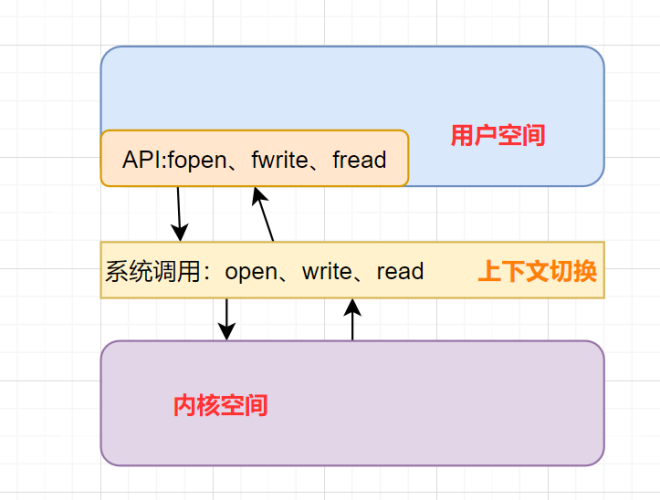
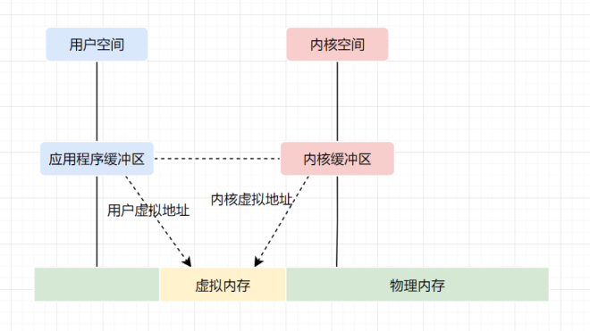
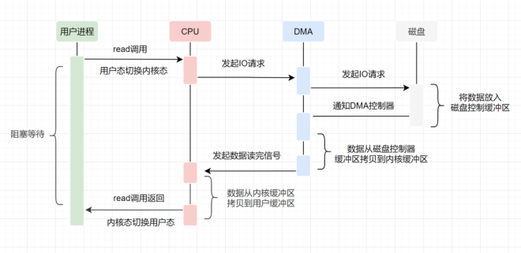

# 零拷贝涉及的操作系统知识点

## 1. 内核空间和用户空间
我们电脑上跑着的应用程序，其实是需要经过**操作系统**，才能做一些特殊操作，如磁盘文件读写、内存的读写等等。因为这些都是比较危险的操作，**不可以由应用程序乱来**，只能交给底层操作系统来。

因此，操作系统为每个进程都分配了内存空间，一部分是用户空间，一部分是内核空间。**内核空间是操作系统内核访问的区域，是受保护的内存空间，而用户空间是用户应用程序访问的内存区域。** 以32位操作系统为例，它会为每一个进程都分配了**4G**(2的32次方)的内存空间。

+ 内核空间：主要提供进程调度、内存分配、连接硬件资源等功能
+ 用户空间：提供给各个程序进程的空间，它不具有访问内核空间资源的权限，如果应用程序需要使用到内核空间的资源，则需要通过系统调用来完成。进程从用户空间切换到内核空间，完成相关操作后，再从内核空间切换回用户空间。

## 2. 什么是用户态、内核态
+ 如果进程运行于内核空间，被称为进程的内核态
+ 如果进程运行于用户空间，被称为进程的用户态。

## 3. 什么是上下文切换
+ 什么是CPU上下文？

CPU 寄存器，是CPU内置的容量小、但速度极快的内存。而程序计数器，则是用来存储 CPU 正在执行的指令位置、或者即将执行的下一条指令位置。它们都是 CPU 在运行任何任务前，必须的依赖环境，因此叫做CPU上下文。

+ 什么是**CPU上下文切换**？

它是指，先把前一个任务的CPU上下文（也就是CPU寄存器和程序计数器）保存起来，然后加载新任务的上下文到这些寄存器和程序计数器，最后再跳转到程序计数器所指的新位置，运行新任务。

一般我们说的**上下文切换**，就是指内核（操作系统的核心）在CPU上对进程或者线程进行切换。进程从用户态到内核态的转变，需要通过**系统调用**来完成。系统调用的过程，会发生**CPU上下文的切换**。

CPU 寄存器里原来用户态的指令位置，需要先保存起来。接着，为了执行内核态代码，CPU 寄存器需要更新为内核态指令的新位置。最后才是跳转到内核态运行内核任务。

## 4. 虚拟内存
现代操作系统使用虚拟内存，即虚拟地址取代物理地址，使用虚拟内存可以有2个好处：

+ 虚拟内存空间可以远远大于物理内存空间
+ 多个虚拟内存可以指向同一个物理地址

正是**多个虚拟内存可以指向同一个物理地址**，可以把内核空间和用户空间的虚拟地址映射到同一个物理地址，这样的话，就可以减少IO的数据拷贝次数啦，示意图如下

## 5. DMA技术
DMA，英文全称是**Direct Memory Access**，即直接内存访问。**DMA**本质上是一块主板上独立的芯片，允许外设设备和内存存储器之间直接进行IO数据传输，其过程**不需要CPU的参与**。

我们一起来看下IO流程，DMA帮忙做了什么事情.

+ 用户应用进程调用read函数，向操作系统发起IO调用，进入阻塞状态，等待数据返回。
+ CPU收到指令后，对DMA控制器发起指令调度。
+ DMA收到IO请求后，将请求发送给磁盘；
+ 磁盘将数据放入磁盘控制缓冲区，并通知DMA
+ DMA将数据从磁盘控制器缓冲区拷贝到内核缓冲区。
+ DMA向CPU发出数据读完的信号，把工作交换给CPU，由CPU负责将数据从内核缓冲区拷贝到用户缓冲区。
+ 用户应用进程由内核态切换回用户态，解除阻塞状态

可以发现，DMA做的事情很清晰啦，它主要就是**帮忙CPU转发一下IO请求，以及拷贝数据**。

> 为什么需要它的？
>
> 主要就是效率，它帮忙CPU做事情，这时候，CPU就可以闲下来去做别的事情，提高了CPU的利用效率。大白话解释就是，CPU老哥太忙太累啦，所以他找了个小弟（名叫DMA） ，替他完成一部分的拷贝工作，这样CPU老哥就能着手去做其他事情。
>

> 更新: 2024-10-31 09:32:43  
> 原文: <https://www.yuque.com/u12222632/as5rgl/iw0y4y9hgxfo2gfg>