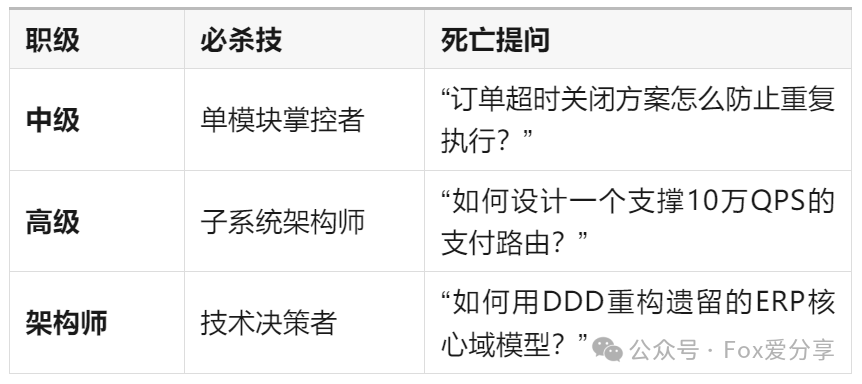

# 面试官的灵魂拷问：你用的Redis，敢不敢让我死磕细节？15年架构师揭秘技术岗“地狱级”考核逻辑

### **导语**
“面试造火箭，入职拧螺丝”？不！作为架构师，我专治“简历包装党”——今天用一篇干到裂开的长文，教你如何用**真枪实弹的项目经验**，正面硬刚腾讯/阿里P8级面试官的**地狱十八问**！

### **一、别再背八股文！架构师要的是“刀刀见血”的项目解剖**
当你说出“我用过Dubbo”时，我的问题会像手术刀般精准：

1. **技术底层切割：**
    - “Dubbo底层通信框架是Netty还是Mina？”
    - “Netty的NIO线程模型怎么解决惊群问题？”
    - “TCP长连接的心跳机制设计阈值是多少？”
2. **源码级拷问：**
    - “Dubbo负载均衡算法的加权随机实现看过吗？”（翻出源码第873行）
    - “服务降级时Sentinel滑动时间窗口如何计算QPS？”

**💡**** 生存法则**：**不要背参数**，要像CT扫描般展示你**改造过源码的Git提交记录**！

### **二、Redis？我要的是你的“业务解剖报告”**
当简历出现“精通Redis”，我会直接甩出**连环杀招**：

面试官OS： 

**1. 商品详情页缓存？**→ 为什么不用本地缓存？缓存穿透率多少？

2.** 用Hash存订单数据？**→ 大Key拆分策略是什么？渐进式rehash触发条件？  

**3. 缓存雪崩方案？**→ 热点数据二级缓存结构图能现场画吗？ 

4**. 集群模式？**→ Codis和Redis Cluster脑裂场景如何容错？  

**真实案例**：某候选人说“用Redis实现分布式锁”，被我要求**手写Redlock算法**，结果他颤抖着写出了**setnx+pexpire+lua脚本**三重保险方案，当场发offer！

### **三、职级天花板：你扛过多少“人月神话”级战役？**
**技术职级的分水岭藏在项目履历里****：**

**血泪教训**：那个自称“主导过亿级流量项目”的候选人，在被追问“全链路压测时数据库连接池峰值配置”时，额头渗出了比Redis集群还密集的汗珠...

### **四、系统设计：给我一个业务，还你一座“技术军火库”**
**现场命题作文才是终极试炼**：**题目**：《设计一个双11秒杀系统，要求百万QPS下库存不超卖》

**满分答案框架**：

1. **分层削峰：****CDN静态化 → 网关限流 → 队列泄洪**
2. **缓存爆破：****Redis+Lua分布式锁 → 本地缓存热点探测**
3. **数据一致：异步MQ扣库存 → 柔性事务补偿**
4. **熔断降级：****Sentinel规则动态推送 → 服务权重自动调整**

**考官视角**：我要的不是教科书答案，而是你**被高并发吊打后的疤痕组织**！

### **五、软实力：代码之外的血与骨**
当你说“带过10人团队”，我会化身**刑警测谎仪**：

+ **进度失控：****“如何用燃尽图发现某开发在划水？”**
+ **技术分歧：****“怎么说服团队放弃Mycat改用ShardingSphere？”**
+ **甩锅大战：****“当测试说‘服务器崩了是你的代码问题’，你第一反应查哪条监控指标？”**

**灵魂暴击**：那个因为“团队内讧”导致项目delay三个月的故事，你敢不敢直面？

### **结语**
技术面试不是考试，而是一场**技术人格的CT扫描**。用真实伤疤代替虚假包装，用深度思考碾压套路话术——毕竟，能在深夜扛住线上P0故障的人，绝不会被几个技术细节问倒。

**（关注公众号“Fox爱分享”回复“认知”，领取《架构师技术栈自查清单》，测测你能拿几分？）**

**↓↓↓ 你在面试中被问过最刁钻的问题是什么？评论区见！ ↓↓↓**

****

****

### 

> 更新: 2025-03-10 13:00:32  
> 原文: <https://www.yuque.com/u12222632/as5rgl/zr0ibizuqevqhu8c>