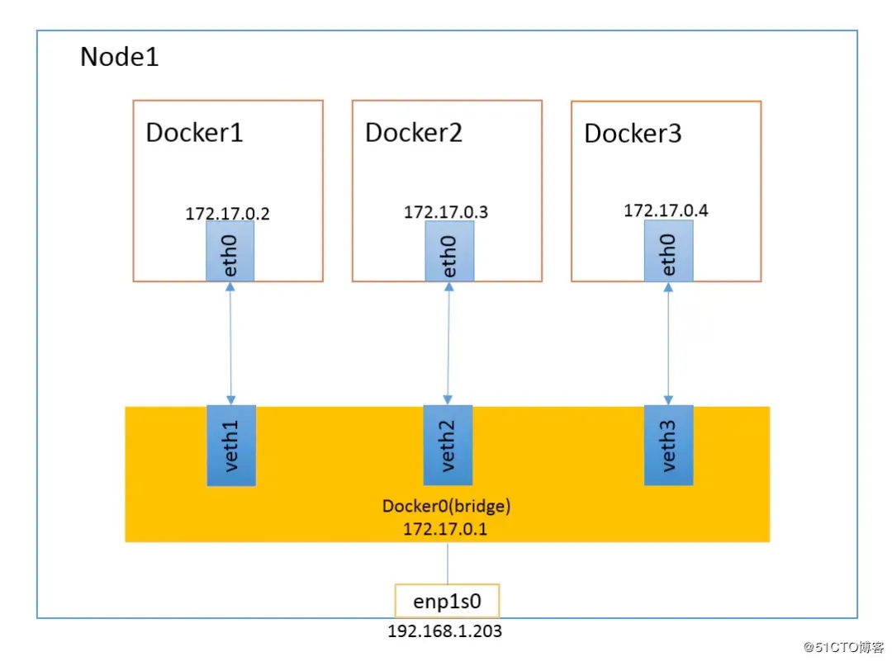
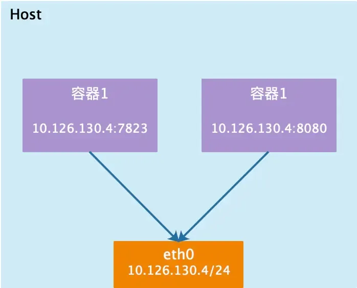
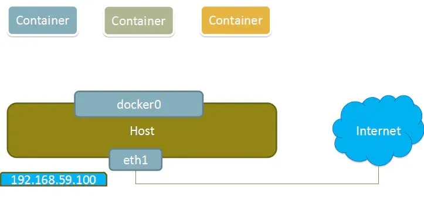
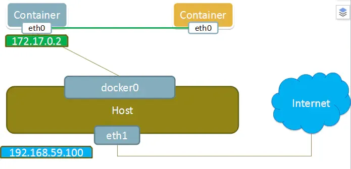

# 面试官：Docker和虚拟机的区别是什么?Docker如何实现数据持久化?Docker镜像是如何分层?Docker网络模式有哪些

面试题概览：

+ 什么是Docker？能不能说说看Docker和虚拟机的区别是什么？
+ Docker如何实现数据的持久化?
+ 什么是Docker镜像？能说说看Docker镜像是如何分层的吗？这样做有什么好处？如何尽可能的优化Docker镜像的大小呢？
+ 能不能说说看什么是Docker Compose，它是如何工作的？
+ 多个容器间的通信如何实现？
+ Docker提供了哪些网络模式，这些模式的优缺点是什么？  

  

  

**面试官：什么是Docker？能不能说说看Docker和虚拟机的区别是什么？**

Docker 是一个开源的应用容器引擎，让开发者可以打包他们的应用以及依赖包到一个可移植的容器中，然后发布到任何支持 Docker 的平台上。这个容器是完全使用沙箱机制，相互之间不会有任何接口，更重要的是容器性能开销极低。

Docker 的主要特性包括：

1. **轻量级与可移植性**：
    - Docker 容器可以在几乎任何平台上运行，包括本地开发环境、云服务器、甚至是边缘设备。
    - 容器比虚拟机更轻量，因为它们共享宿主机的操作系统内核，启动速度更快且资源占用更少。
2. **环境一致性**：
    - Docker 容器确保开发、测试和生产环境之间的一致性，因为容器包含了应用程序及其所有依赖项。
    - 这有助于减少“在我机器上工作正常”的问题，因为开发者可以确保他们的代码在目标环境中以相同的方式运行。
3. **隔离性**：
    - Docker 容器提供了进程级隔离，这意味着每个容器都运行在自己的命名空间中，互不干扰。
    - 这种隔离性增强了安全性，因为一个容器中的问题通常不会影响到其他容器或宿主机。
4. **版本控制与镜像**：
    - Docker 镜像可以被视为应用程序的快照，它们可以被版本控制并存储在 Docker Hub 或其他容器镜像库中。
    - 开发者可以轻松地从镜像库中拉取或推送镜像，从而实现版本管理和团队协作。
5. **可扩展性与编排**：
    - Docker 容器可以轻松地扩展，因为它们是轻量级的且可以快速启动。
    - Docker Swarm 和 Kubernetes 等容器编排工具允许开发者在多个宿主机上部署和管理容器集群，从而实现高可用性和弹性伸缩。
6. **自动化与CI/CD**：
    - Docker 与持续集成/持续部署（CI/CD）工具紧密集成，如 Jenkins、GitLab CI/CD 和 CircleCI。
    - 这使得自动化构建、测试和部署成为可能，从而加快了软件开发周期。

  

Docker与虚拟机是两种不同的虚拟化技术，各自具有独特的特点和优势。以下是两者的主要区别：

### 一、技术架构与资源利用
1. **虚拟机**：
    - 通过Hypervisor（虚拟机管理程序）创建虚拟硬件环境，模拟完整的计算机系统，包括处理器、内存、硬盘等。
    - 每个虚拟机运行一个完整的操作系统副本，占用较多的系统资源，如CPU、内存、磁盘空间等。
2. **Docker**：
    - 基于容器化技术，使用Linux内核的namespace和cgroup功能实现资源隔离。
    - 容器共享宿主机的操作系统内核，只运行所需的应用程序和依赖项，资源消耗较少。

### 二、启动速度与性能
1. **虚拟机**：
    - 启动时间较长，通常需要几分钟，因为它需要加载整个操作系统和相关服务。
    - 在大量并发情况下，系统开销较大，可能导致资源浪费。
2. **Docker**：
    - 启动时间极短，通常只需几秒钟，因为容器只需要启动必要的应用程序及其依赖，无需初始化整个操作系统。
    - 容器共享宿主机内核，避免了冗余内核开销，提高了服务器的利用率和整体效率。

### 三、隔离性与安全性
1. **虚拟机**：
    - 提供了强隔离，每个虚拟机之间通过硬件辅助的虚拟化技术实现近乎完全的隔离。
    - 安全风险相对较低，即便一个虚拟机内部遭到入侵，一般情况下无法直接影响到宿主机或其他虚拟机。
2. **Docker**：
    - 提供了一定程度的隔离，但基于进程和用户空间的隔离程度不如虚拟机彻底。
    - 容器间的隔离依赖于内核提供的命名空间、控制组等功能，如果内核出现漏洞，可能导致容器间的安全边界被破坏。
    - 容器内部的root权限在宿主机上也是root权限，如果恶意程序获取了容器内部的root权限，理论上有可能影响到宿主机或者其他容器。不过可以通过安全配置和安全策略来降低这类风险。

### 四、部署与可移植性
1. **虚拟机**：
    - 每个虚拟机包含其自身的完整环境，部署时需考虑操作系统及各种库的兼容性。
    - 迁移成本较高，因为需要迁移整个操作系统和应用程序。
2. **Docker**：
    - 通过Docker镜像提供一致的运行环境，简化了部署过程。
    - 能够在任何支持Docker的平台上快速、一致地部署应用程序，增强了可移植性。

### 五、管理与监控
1. **虚拟机**：
    - 管理和监控相对复杂，因为每个虚拟机都需要独立管理。
2. **Docker**：
    - 管理相对简单，因为容器可以集中管理和监控。
    - 提供了便捷的管理和监控工具，如Dockerfile（定义应用程序的构建过程）、Docker Compose（管理多个容器的部署）、Docker Swarm或Kubernetes（实现容器集群的管理）等。

  

  

**面试官：****Docker如何实现数据的持久化？**

  

Docker实现数据持久化主要有以下几种方式：

  

### 一、数据卷（Volumes）
数据卷是Docker中一种持久化存储数据的方式，它绕过了Union File System，提供了独立于容器生命周期的存储。数据卷可以在容器之间共享和重用，对其进行的更新不会影响镜像。使用数据卷的方式有两种：

1. 在运行容器时直接挂载本地目录至容器中，例如使用`docker run -v`命令。这种方式下，宿主机上的目录会被挂载到容器内的指定路径上。
2. 使用Docker管理的数据卷。可以通过`docker volume create`命令创建一个数据卷，然后在运行容器时使用`--mount`或`-v`选项将数据卷挂载到容器内。这种方式下，Docker会在宿主机上的`/var/lib/docker/volumes/`目录下为数据卷创建一个独立的存储空间。

### 二、绑定挂载（Bind Mounts）
绑定挂载允许将宿主机的文件或目录直接挂载到容器中。这种方式下，容器和主机之间可以共享文件系统，并且数据的持久化由主机来保证。使用绑定挂载的方式同样有两种：

1. 在运行容器时使用`--mount`选项，并指定`type=bind`以及`source`（宿主机上的路径）和`target`（容器内的路径）。
2. 使用`-v`选项，并指定宿主机路径和容器内路径的映射关系。

### 三、数据卷容器（Data Volume Container）
数据卷容器是一个专门用来存储数据卷的容器，其他容器可以通过挂载数据卷容器来访问其中的数据。这种方式可以将数据和应用逻辑分离，方便备份和迁移数据。创建数据卷容器的方式与普通容器类似，但需要在运行容器时指定`-v`选项来创建数据卷。然后，其他容器可以通过`--volumes-from`选项来挂载这个数据卷容器中的数据卷。

### 四、使用远程存储
除了上述三种方式外，还可以将数据存储在远程的存储系统中，如NFS、GlusterFS、Ceph等。容器可以通过网络访问远程存储来实现数据持久化。这种方式需要配置相应的存储系统和网络访问权限。

  

### 注意事项
1. 在选择持久化方式时，需要根据具体场景和需求进行权衡。例如，对于需要频繁读写和共享的数据，可以使用数据卷或绑定挂载；对于需要高可用性和弹性伸缩的应用场景，可以考虑使用远程存储。
2. 持久化可以解决数据丢失的问题，但也可能带来数据安全和一致性方面的挑战。因此，在实际使用过程中，还需要结合其他策略，如数据备份、数据加密等，以确保数据的安全性和可靠性。

  

  

**面试官：什么是Docker镜像？能说说看Docker镜像是如何分层的吗？这样做有什么好处？如何尽可能的优化Docker镜像的大小呢？**

Docker镜像是一种轻量级、可执行的独立软件包，用于打包软件运行环境和基于该环境开发的软件。它包含了运行某个软件所需的所有内容，包括代码、运行时库、环境变量、配置文件等。

Docker镜像由多个层（Layers）组成，每个层都代表了镜像的一个修改或操作。这种分层的结构使得镜像的构建、存储和传输变得高效和灵活。具体来说，Docker镜像的组成包括：

1. **引导文件系统（bootfs）**：这是镜像的最底层，包含bootloader和Kernel，类似于典型的Linux/Unix的引导文件系统。然而，在Docker中，用户通常不会与引导文件系统交互，因为它在容器启动后会被卸载，以留出更多的内存供其他使用。
2. **根文件系统（rootfs）**：在bootfs之上，包含了典型的Linux系统中的标准目录和文件，如/dev、/proc、/bin、/etc等。这些目录和文件构成了容器的操作系统环境，可以是不同的Linux发行版，如Ubuntu、CentOS等。

  

Docker镜像主要用于以下方面：

1. **创建容器**：镜像是创建Docker容器的模板。通过指定一个镜像，可以实例化出一个或多个容器，这些容器将包含镜像中定义的所有内容，并可以运行其中的应用程序。
2. **分发和部署**：镜像可以被分发到不同的环境中，并在这些环境中以相同的方式运行。这使得应用程序的部署变得更加简单和可靠，因为开发者可以确保他们的代码在目标环境中以相同的方式运行。
3. **版本控制**：由于镜像是由多个层组成的，因此可以轻松地对其进行版本控制。开发者可以创建、推送、拉取和回滚镜像版本，以确保应用程序的稳定性和可靠性。

  

再说说Docker的镜像分层，Docker镜像的层次结构是其核心特性之一，它允许Docker镜像由多个只读层组成，这些层叠加在一起形成一个完整的文件系统。

  

以下是Docker镜像层次结构的工作原理：

### 层次结构概述
1. **基础层**：作为镜像的起点，通常是操作系统的镜像，如Ubuntu、Alpine等。这一层为后续层提供了基础环境和工具。
2. **中间层**：包含应用程序及其依赖。这些层由Dockerfile中的指令如RUN、COPY和ADD创建，每执行一个指令就会创建一个新的层。
3. **顶层**：通常是包含最终应用程序代码和配置的层。这一层在容器启动时会被一个可写层覆盖，用于存储运行时数据。

### 层次结构的工作方式
1. **层的创建**：每个Dockerfile指令都会创建一个新的层，这些层是不可变的。当执行`docker build`命令时，Docker会按照Dockerfile中的指令顺序执行，并为每个指令创建一个新的层。
2. **层的共享**：由于多个镜像可以共享相同的基础层，Docker会自动复用这些层，减少了重复数据的存储。这种设计使得存储效率得到优化，因为多个容器可以共享相同的基础层，而无需重复存储相同的数据。
3. **UnionFS技术**：Docker使用UnionFS（联合文件系统）技术将多个层合并为一个统一的文件系统视图。这样，用户就可以看到一个完整的文件系统，而不需要关心底层的镜像层是如何组织的。UnionFS还支持写时复制（Copy-on-Write, CoW）机制，当容器中的文件需要被修改时，系统会首先在容器层中创建一个该文件的副本，并在副本上进行修改，从而避免了对原始镜像层的直接修改。
4. **可写层**：当Docker容器启动时，会在镜像的最顶层添加一个可写层，即容器层。容器中的所有更改（如文件写入、删除等）都会发生在这个可写层中，而不会影响到下层的镜像层。如果容器被删除，其容器层也会被删除，但底层的镜像层仍然保留在系统中，以便其他容器可以共享使用。

### 层次结构的优势
1. **存储效率**：由于层的复用，Docker镜像的大小通常远小于虚拟机镜像。据统计，Docker镜像的平均大小比虚拟机镜像小10倍。
2. **构建性能**：Docker利用层的缓存机制来提高构建效率。如果Dockerfile中的指令没有变化，Docker会重用之前的构建结果，而不是重新执行指令。这种缓存机制使得Docker镜像的构建速度比传统的虚拟机快10到100倍。
3. **安全性**：由于每个层都是只读的，并且容器层与镜像层分离，因此Docker容器的安全性得到了增强。即使容器被攻击或损坏，底层的镜像层仍然保持不变，可以轻松地恢复或重建容器。

  

对于Docker镜像而言，优化Docker镜像大小十分有必要，它对于提高部署速度、减少存储空间以及增强安全性都至关重要。

  

以下是一些具体的优化策略：

### 选择合适的基础镜像
+ **使用更小的基础镜像**：选择轻量级且安全的基础镜像，如Alpine Linux，而不是完整的Ubuntu或Debian。Alpine Linux提供了更小的镜像大小，同时保持了良好的安全性和稳定性。

  

### 减少镜像层数
+ **合并RUN指令**：在Dockerfile中，将多个RUN指令合并为一个，以减少镜像的层数。每一次RUN指令都会创建一个新的镜像层，合并指令可以减少整体大小。
+ **利用Dockerfile的多阶段构建**：多阶段构建允许在不同的构建阶段中执行不同的操作，只将最终应用和其运行所需的最小组件包含到生产镜像中。这有助于减小最终镜像的大小。

### 清理不必要的文件和依赖
+ **删除不必要的软件包**：在构建过程的最后阶段，删除仅在构建过程中需要的软件包。
+ **清理缓存和临时文件**：在构建过程中删除不必要的缓存和临时文件，如使用`apt-get clean`命令清理Debian或Ubuntu镜像中的缓存。
+ **使用**`**.dockerignore**`**文件**：在构建镜像时，使用`.dockerignore`文件来排除不需要的文件和目录，以减小镜像的大小。

### 压缩文件和目录
+ **压缩文件**：在构建镜像时，可以使用gzip、bzip2等工具压缩需要添加到镜像中的文件和目录。在Dockerfile中使用RUN指令进行压缩，可以减小镜像的大小。
+ **使用更高效的存储格式**：如Overlay2等现代存储驱动程序可以提供更好的压缩和分层管理，有助于减小镜像的存储空间占用。

### 其他优化策略
+ **使用非root用户运行容器**：在Dockerfile中使用非root用户运行容器可以减少镜像的大小，因为root用户通常需要更多的权限和文件，这可能会导致镜像大小增加。
+ **配置文件外部化**：将配置文件从镜像中分离，通过环境变量或挂载卷在运行时提供。这有助于减小镜像的大小并提高配置的灵活性。
+ **利用数据卷或绑定挂载**：将数据持久化在容器外部，而不是包含在镜像中。这不仅可以减小镜像的大小，还可以提高数据的安全性和可移植性。
+ **使用镜像优化工具**：有一些工具可以帮助优化Docker镜像大小，例如docker-slim等。这些工具可以通过删除不必要的文件和优化镜像配置来减小镜像大小。

  

  

**面试官：能不能说说看什么是Docker Compose，它是如何工作的？**

说到Docker Compose就得先说说看容器编排。Docker容器编排是一种管理和协调多个Docker容器的技术，旨在简化容器化应用程序的部署、扩展和管理。当应用由许多容器组成时，手动管理和协调这些容器可能会变得复杂和耗时，这时就是容器编排工具的用武之地。

Docker容器编排工具就包括Docker Compose、Docker Swarm和Kubernetes。Docker Compose适用于定义和运行多个容器的场景，而Docker Swarm和Kubernetes则提供了更强大和复杂的容器编排和集群管理能力。

**  
**

### 基本概念
1. **服务（Services）**：在Docker Compose中，一个服务定义了容器在生产环境中的行为。一个服务可以是一个单独的容器，也可以是多个容器的集群。
2. **项目（Projects）**：一个项目是由一组服务（容器）组成的完整应用程序。在Docker Compose中，一个项目通常对应一个docker-compose.yml文件。
3. **配置文件（docker-compose.yml）**：这是Docker Compose的核心文件，包含了应用程序中所有服务的配置信息。

  

Docker Compose的工作原理主要基于YAML配置文件（通常为docker-compose.yml）来定义和运行多容器的Docker应用程序。以下是Docker Compose工作的详细步骤和原理：

### 一、配置文件定义
1. **服务定义**：在docker-compose.yml文件中，用户可以定义多个服务，每个服务代表一个Docker容器。服务定义包括容器镜像、端口映射、环境变量、依赖关系等信息。
2. **网络定义**：Compose提供内置的网络功能，允许用户在配置文件中定义自定义网络，并指定服务如何连接到这些网络。这使得服务容器可以在同一网络空间内相互通信。
3. **卷定义**：用户还可以在配置文件中定义数据卷，用于服务之间的数据共享和持久化存储。

### 二、解析配置文件
当用户执行docker-compose命令时，Docker Compose会首先解析docker-compose.yml文件，读取并解析其中定义的服务、网络和卷等配置信息。

### 三、构建和启动服务
1. **构建镜像**：如果服务定义了使用自定义的Dockerfile来构建镜像，Docker Compose会首先根据Dockerfile构建镜像。
2. **创建网络**：根据配置文件中定义的网络信息，Docker Compose会创建相应的网络。
3. **启动容器**：Docker Compose会按照配置文件中定义的顺序和依赖关系，依次启动服务容器。在启动过程中，Docker Compose会确保先启动依赖的服务，再启动依赖于它们的服务。

  

  

**面试官：****多个容器间的通信如何实现？**

  

### 一、通过容器IP访问
每个容器在启动时都会被分配一个IP地址。在理想情况下，容器之间可以直接通过各自的IP地址进行通信。然而，这种方法的缺陷在于，当容器重启后，其IP地址可能会发生变化，因此，通过固定的IP地址进行通信不是一个可靠的长期方案。

  

### 二、通过宿主机端口映射
容器可以将自身的某个端口映射到宿主机的某个端口上，从而使外部网络或其他容器能够通过访问宿主机的IP地址和对应端口来间接访问该容器。这种方式常用于外部访问容器内的服务，但在容器间通信时，可能会因为需要管理多个端口映射而显得不够灵活和高效。

  

### 三、使用Docker Link功能
Docker提供了一个Link功能，允许在启动容器时使用`--link`参数来建立容器之间的链接。通过这种方式，容器内部可以使用别名来访问其他容器，并且Docker会在接受者容器内部设置一系列环境变量和更新`/etc/hosts`文件，以便通过别名解析到源容器的IP地址。然而，需要注意的是，Docker官方已经不建议在新项目中使用Link功能，因为它可能会导致一些难以调试的网络问题，并且不支持跨主机的容器通信。

  

### 四、使用Docker网络
Docker网络是一种更为灵活和强大的容器间通信方式。用户可以创建自定义的Docker网络，并将多个容器连接到同一个网络中。在同一网络中的容器可以直接使用容器的名称或IP地址进行通信，无需通过宿主机进行端口转发。Docker网络支持多种网络模式，包括bridge（桥接模式）、host（主机模式）、overlay（覆盖网络模式）等，可以根据具体需求选择适合的网络模式。

  

### 五、使用Docker Compose
向刚刚所说的，Docker Compose是一个用于定义和运行多个Docker容器的工具。通过编写`docker-compose.yml`文件，用户可以定义服务之间的依赖关系和网络连接。Docker Compose会根据定义自动创建网络、启动容器，并处理容器之间的通信问题。

  

### 六、使用共享数据卷
虽然共享数据卷主要用于容器间的数据共享，但在某些情况下，它也可以作为一种间接的通信方式。通过创建共享的数据卷，多个容器可以将数据卷挂载到自己的文件系统中，从而实现数据的读写和共享。这种方式适用于一些需要共享状态或数据的容器间通信场景。

  

### 七、使用外部服务或中间件
在某些复杂的微服务架构中，可能需要使用外部服务或中间件来实现容器间的通信。例如，可以使用消息队列（如RabbitMQ、Kafka等）来实现异步通信；可以使用服务注册与发现（如Eureka、Consul等）来动态管理容器间的服务地址；还可以使用API网关来统一管理和路由请求到不同的容器服务。这些外部服务或中间件提供了更加灵活和可靠的容器间通信方式，但也需要额外的配置和管理成本。

  

  

**面试官：Docker提供了哪些网络模式，这些模式的优缺点是什么？**

  

### 一、bridge模式（桥接模式）
+ **描述**：

当Docker进程启动时，会在主机上创建一个名为docker0的虚拟网桥，此主机上启动的Docker容器会连接到这个虚拟网桥上。

虚拟网桥的工作方式和物理交换机类似，这样主机上的所有容器就通过交换机连在了一个二层网络中。

+   

从docker0子网中分配一个IP给容器使用，并设置docker0的IP地址为容器的默认网关。在主机上创建一对虚拟网卡veth pair设备，Docker将veth pair设备的一端放在新创建的容器中，并命名为eth0（容器的网卡），另一端放在主机中，以vethxxx这样类似的名字命名，并将这个网络设备加入到docker0网桥中。可以通过brctl show命令查看。

+   

bridge模式是docker的默认网络模式，不写--net参数，就是bridge模式。使用docker run -p时，docker实际是在iptables做了DNAT规则，实现端口转发功能。可以使用iptables -t nat -vnL查看。

  

+ **优点**：
    - 提供了较好的网络隔离性和灵活性。
    - 多个容器可以连接到同一个网桥上，彼此之间可以通信，同时保持与外部网络的连通性。
    - 适用于构建复杂的多容器应用程序，特别是需要容器之间互相通信的场景。
+ **缺点**：
    - 容器IP地址和端口号都是独立的，需要端口映射才能让主机上的应用程序访问容器的服务。
    - 桥接网络需要进行网络地址转换（NAT），可能会引入一定的性能损失。
    - 如果多个容器使用相同的端口号，可能会导致端口冲突。

### 二、host模式
+ **描述**：在host模式下，容器将加入到主机的网络栈中，直接使用主机的网络接口和IP地址。这意味着容器可以直接访问主机的网络资源和服务，而无需进行端口映射。
+ 我们知道，Docker使用了Linux的Namespaces技术来进行资源隔离，如PID Namespace隔离进程，Mount Namespace隔离文件系统，Network Namespace隔离网络等。

  

+ 一个Network Namespace提供了一份独立的网络环境，包括网卡、路由、Iptable规则等都与其他的Network Namespace隔离。

一个Docker容器一般会分配一个独立的Network Namespace。但如果启动容器的时候使用host模式，那么这个容器将不会获得一个独立的Network Namespace，而是和宿主机共用一个Network Namespace。容器将不会虚拟出自己的网卡，配置自己的IP等，而是使用宿主机的IP和端口。

+   

+   

+ **优点**：
    - 与桥接网络相比，主机网络模式可以提供更高的网络性能，因为容器直接使用主机的网络接口，无需进行额外的网络地址转换。
    - 容器与主机共享网络命名空间，简化了网络配置，无需进行端口映射或网络转发配置。
+ **缺点**：
    - 容器与主机共享网络命名空间，可能会增加安全风险，因为容器可以直接访问主机上的网络资源。
    - 如果多个容器使用相同的端口号，可能会导致端口冲突。
    - 网络的隔离性不好。

### 三、none模式（无网络模式）
+ **描述**：在none模式下，容器没有任何网络接口、网卡、IP、路由等信息，与外部网络完全隔离。这种模式适用于不需要网络连接的容器，例如批处理任务或与网络无关的应用。
+   

+ **优点**：
    - 提供了更高的安全性，因为容器与外部网络完全隔离。
    - 节省了网络资源，因为容器不需要网络接口和IP地址。
+ **缺点**：
    - 容器无法与外部网络或其他容器进行通信，限制了其应用场景。

### 四、container模式（容器模式）
+ **描述**：在container模式下，新创建的容器和已经存在的一个容器共享一个Network Namespace，而不是和宿主机共享。新创建的容器不会创建自己的网卡、配置自己的IP，而是和一个指定的容器共享IP、端口范围等。两个容器的进程可以通过lo网卡设备通信。两个容器除了网络方面，其他的如文件系统、进程列表等还是隔离的。
+   

+ **优点**：
    - 两个容器之间可以方便地共享网络资源和配置，无需额外的网络配置。
+ **缺点**：
    - 增加了网络配置的复杂性，因为需要确保两个容器之间的网络兼容性。
    - 可能会引入安全风险，因为两个容器共享网络命名空间。

> 更新: 2025-03-10 12:57:32  
> 原文: <https://www.yuque.com/u12222632/as5rgl/gwe2w4gdg2cy981c>