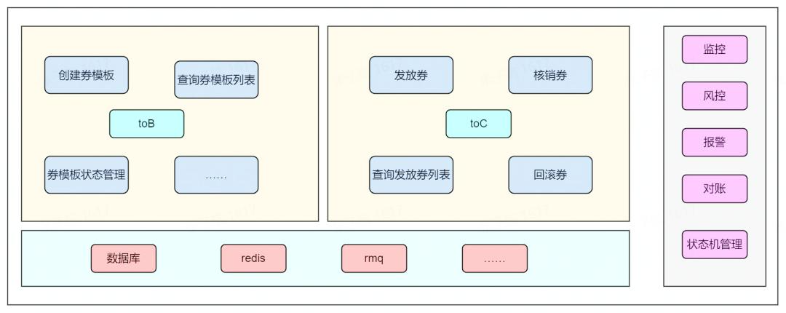
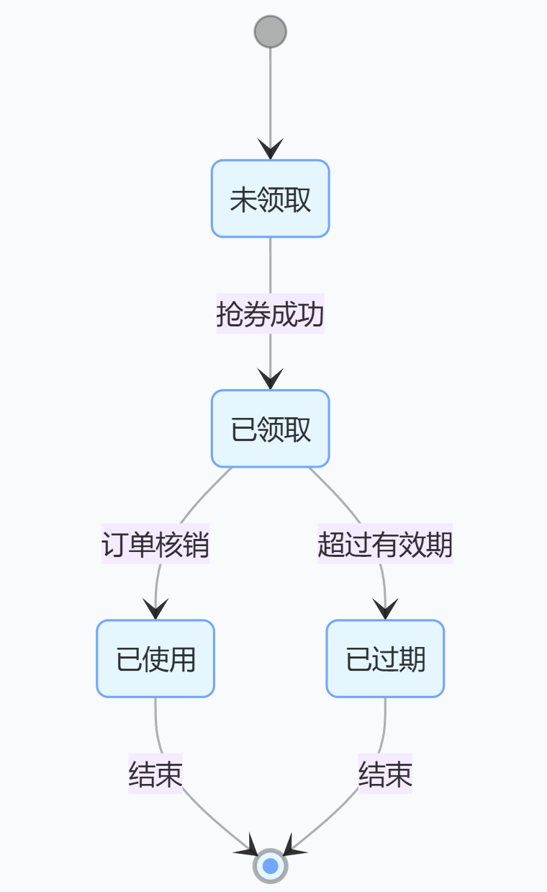

# 高并发抢券系统设计之幂等篇：幂等性实战指南，从唯一ID到状态机的一致性保障 !



<font style="color:rgba(0, 0, 0, 0.85);">在某电商平台的双 11 活动中，用户多次点击 "抢券" 按钮导致重复领券，最终库存超卖 23%。这揭示了分布式系统设计的核心命题：</font>**如何确保无论请求重试多少次，业务结果始终一致？**<font style="color:rgba(0, 0, 0, 0.85);"> 本文将从唯一标识生成、接口设计、重试机制三个维度，拆解幂等性设计的工程实现细节，附雪花算法代码、状态机设计图及消息队列去重实践。</font>

<font style="color:rgb(0, 0, 0);">（本文为《高并发抢券系统设计》系列第四篇，点击[回顾限流篇]、[回顾防刷篇]、[回顾第一篇全链路设计]，聚焦分布式系统中的操作唯一性保障）</font>

## <font style="color:rgb(0, 0, 0);">一、唯一标识生成：请求去重的「数字指纹」</font>
### <font style="color:rgb(0, 0, 0);">1. 全局唯一请求 ID 生成方案</font>
**雪花算法（Snowflake）实现（Java 版）**

```java
public class IdGenerator {
    private final long workerId;
    private long sequence = 0L;
    private long lastTimestamp = -1L;

    public IdGenerator(long workerId) {
        this.workerId = workerId;
    }

    public synchronized long generateId() {
        long timestamp = System.currentTimeMillis();
        // 时钟回退处理（极端场景下的容错）
        if (timestamp < lastTimestamp) { 
            timestamp = lastTimestamp;
        }
        if (timestamp == lastTimestamp) {
            sequence = (sequence + 1) & 0xFFF; // 4095内循环
            if (sequence == 0) {
                timestamp = tilNextMillis(lastTimestamp);
            }
        } else {
            sequence = 0;
        }
        lastTimestamp = timestamp;
        return ((timestamp - 1483228800000L) << 23) | // 41位时间戳
               (workerId << 10) | // 10位工作节点
               sequence; // 12位序列号
    }

    private long tilNextMillis(long lastTimestamp) {
        long timestamp = System.currentTimeMillis();
        while (timestamp <= lastTimestamp) {
            timestamp = System.currentTimeMillis();
        }
        return timestamp;
    }
}
```

<font style="color:rgb(0, 0, 0);"></font>

_优势_：生成 64 位唯一 ID，包含时间戳（41 位）、工作节点（10 位）、序列号（12 位），QPS 可达 409.6 万 / 节点。

### <font style="color:rgb(0, 0, 0);">2. 服务端去重逻辑：Redis 原子操作实现</font>
```java
// 请求ID格式：seckill:20250419:1001:UUID
private static final String REQUEST_KEY_PREFIX = "req:dedup:"; 

public boolean checkDuplicateRequest(String requestId) {
    String key = REQUEST_KEY_PREFIX + requestId;
    try (Jedis jedis = jedisPool.getResource()) {
        // SETNX保证原子性，EX 60设置有效期（避免内存泄漏）
        Long result = jedis.setnx(key, "1"); 
        jedis.expire(key, 60); // 与业务处理超时时间一致
        return result == 0; // 0表示重复请求
    }
}

// 业务处理流程
public ResponseDTO processSeckill(String userId, String couponId, String requestId) {
    if (checkDuplicateRequest(requestId)) {
        return ResponseDTO.success("请求已处理"); // 直接返回成功
    }
    // 执行扣券逻辑...
    return createOrder(userId, couponId);
}
```

<font style="color:rgb(0, 0, 0);">  
</font>

_核心原理_：利用 Redis 的`SETNX + EXPIRE`组合（Redis 6.0 + 可用`SET key value NX EX 60`原子指令），确保 60 秒内相同请求 ID 仅处理一次。

### <font style="color:rgb(0, 0, 0);">3. 数据库唯一索引设计</font>
**订单表防重复领券**

```sql
CREATE TABLE coupon_order (
    id BIGINT PRIMARY KEY AUTO_INCREMENT,
    user_id VARCHAR(64) NOT NULL,
    coupon_id VARCHAR(32) NOT NULL,
    order_time TIMESTAMP DEFAULT CURRENT_TIMESTAMP,
    UNIQUE KEY uk_user_coupon (user_id, coupon_id)
);
```

<font style="color:rgb(0, 0, 0);">  
</font>

**库存扣减表防重复操作**

```sql
CREATE TABLE stock_deduction (
    transaction_id VARCHAR(64) PRIMARY KEY,
    coupon_id VARCHAR(32) NOT NULL,
    deduct_count INT NOT NULL,
    deduct_time TIMESTAMP DEFAULT CURRENT_TIMESTAMP,
    UNIQUE KEY uk_coupon_trans (coupon_id, transaction_id)
);
```

<font style="color:rgb(0, 0, 0);"></font>

_异常处理_：当插入唯一索引冲突时（如 DuplicateKeyException），捕获异常并返回 "操作已完成"，避免业务层重复处理。

## <font style="color:rgb(0, 0, 0);">二、接口设计：幂等性实现的「契约层」保障</font>
### <font style="color:rgb(0, 0, 0);">1. HTTP 方法与幂等性匹配</font>
| **方法** | **幂等性** | **实现方式** | **抢券场景应用** |
| :--- | :--- | :--- | :--- |
| GET | 天然幂等 | 无副作用的查询（如查询券剩余数量） | `/coupon/remain?couponId=1001` |
| POST | 需业务实现 | 请求体携带 requestId 唯一标识 | 提交抢券请求（携带全局唯一 ID） |
| PUT | 天然幂等 | 基于资源 ID 的全量更新（较少使用） | 更新用户收货地址（非核心场景） |
| DELETE | 天然幂等 | 多次删除同一资源结果一致 | 无（抢券场景不涉及资源删除） |


### <font style="color:rgb(0, 0, 0);">2. 状态机驱动的业务流转</font>
**优惠券状态机示意图**




**状态校验代码实现**

```java
@Transactional
public void grantCoupon(String userId, String couponId) {
    CouponEntity coupon = couponRepository.findById(couponId).orElseThrow();
    // 状态校验：仅"未领取"状态可领取
    if (!CouponStatus.UNCLAIMED.equals(coupon.getStatus())) { 
        throw new BusinessException("优惠券状态异常");
    }
    // 扣减库存+更新状态
    stockService.deductStock(couponId);
    coupon.setStatus(CouponStatus.CLAIMED);
    couponRepository.save(coupon);
}
```


_事务保障_：通过 Spring @Transactional 注解，确保库存扣减与状态更新要么同时成功，要么回滚。

### <font style="color:rgb(0, 0, 0);">3. 幂等性接口设计三原则</font>
1. **无副作用查询**：所有`GET`接口不修改业务状态，支持任意次数重试
2. **唯一标识必传**：`POST/PUT`接口请求体中必须包含`requestId`字段，格式校验失败直接返回 400
3. **结果可重入**：接口响应需包含业务状态（如 "已领取"），客户端根据状态决定是否重试

## <font style="color:rgb(0, 0, 0);">三、重试机制：容错与幂等的「协奏曲」</font>
### <font style="color:rgb(0, 0, 0);">1. 客户端重试策略</font>
**Feign 客户端配置（带重试的幂等请求）**

```java
@FeignClient(
    name = "coupon-service",
    fallback = CouponFallback.class,
    configuration = FeignRetryConfig.class
)
public interface CouponClient {
    @PostMapping("/seckill")
    ResponseDTO seckill(@RequestParam("userId") String userId,
                        @RequestParam("couponId") String couponId,
                        @RequestParam("requestId") String requestId);
}

// 重试配置：3次重试，指数退避
@Configuration
public class FeignRetryConfig {
    @Bean
    public Retryer feignRetryer() {
        return new Retryer.Default(100, TimeUnit.SECONDS.toMillis(1), 3);
    }
}
```

### <font style="color:rgb(0, 0, 0);">2. 异步任务幂等消费</font>
**Kafka 消费者去重实现**

```java
@KafkaListener(topics = "coupon-grant-topic")
public void handleGrantCoupon(ConsumerRecord<String, String> record) {
    String messageId = record.headers().lastHeader("message-id").value().toString();
    String key = "msg:processed:" + messageId;
    try (Jedis jedis = jedisPool.getResource()) {
        // 1. 检查消息是否已处理
        if (jedis.exists(key)) {
            return; // 跳过重复消息
        }
        // 2. 执行发券逻辑
        String payload = record.value();
        GrantCouponEvent event = JSON.parseObject(payload, GrantCouponEvent.class);
        doGrantCoupon(event.getUserId(), event.getCouponId());
        // 3. 标记消息已处理（有效期30分钟）
        jedis.setex(key, 1800, "1"); 
    }
}
```

  


_优化点_：消息体中增加`messageId`字段（由生产者生成），消费者通过 Redis 去重，相比数据库唯一索引查询性能提升 5 倍。

### <font style="color:rgb(0, 0, 0);">3. 分布式事务中的幂等补偿</font>
**TCC 模式二阶段确认**


```java
// Try阶段：预占库存（可回滚的临时状态）
public boolean tryDeductStock(String couponId, long count) {
    String key = "stock:pre:" + couponId;
    return jedis.incrby(key, count) <= totalStock.get(couponId);
}

// Confirm阶段：正式扣减（幂等操作，允许重复调用）
public void confirmDeductStock(String couponId, long count) {
    String key = "stock:real:" + couponId;
    jedis.incrby(key, count); // 多次调用结果一致
    jedis.del("stock:pre:" + couponId); // 清理预占状态
}

// Cancel阶段：释放预占库存（幂等操作，允许空释放）
public void cancelDeductStock(String couponId, long count) {
    String key = "stock:pre:" + couponId;
    jedis.decrby(key, count); // 即使key不存在也不影响
}
```

  


_核心逻辑_：Confirm/Cancel 接口通过天然幂等的 Redis 操作实现，避免分布式事务中的悬挂、空补偿问题。

## <font style="color:rgb(0, 0, 0);">四、幂等性设计的五大实战场景</font>
### <font style="color:rgb(0, 0, 0);">1.</font><font style="color:rgb(0, 0, 0);"> </font>**重复提交表单**
+ _方案_：前端生成唯一表单 ID，后端通过 Redis SETNX 去重，配合数据库唯一索引防止重复写入

### <font style="color:rgb(0, 0, 0);">2.</font><font style="color:rgb(0, 0, 0);"> </font>**接口重试机制**
+ _方案_：客户端重试时携带相同 requestId，服务端优先返回缓存的处理结果（如 Redis 存储请求 ID 与响应的映射）

### <font style="color:rgb(0, 0, 0);">3.</font><font style="color:rgb(0, 0, 0);"> </font>**消息重复消费**
+ _方案_：消费者通过消息 ID + 业务 ID 生成唯一键（如`msg:123:order:456`），利用 Redis 或数据库唯一约束实现去重

### <font style="color:rgb(0, 0, 0);">4.</font><font style="color:rgb(0, 0, 0);"> </font>**分布式事务补偿**
+ _方案_：TCC 模式中 Confirm/Cancel 接口设计为幂等，通过状态机（如 "处理中→已完成→已取消"）避免重复操作

### <font style="color:rgb(0, 0, 0);">5.</font><font style="color:rgb(0, 0, 0);"> </font>**跨服务调用**
+ _方案_：在 HTTP Header 中增加`X-Request-ID`字段，全链路传递唯一标识，结合 SkyWalking 实现请求链路追踪

## <font style="color:rgb(0, 0, 0);">五、常见问题与解决方案</font>
### <font style="color:rgb(0, 0, 0);">1.</font><font style="color:rgb(0, 0, 0);"> </font>**唯一 ID 生成性能瓶颈**
+ _陷阱_：雪花算法在分布式节点时钟不同步时可能生成重复 ID
+ _方案_：引入中心时间服务器（NTP），节点时间误差控制在 1ms 内；序列号冲突时自旋等待

### <font style="color:rgb(0, 0, 0);">2.</font><font style="color:rgb(0, 0, 0);"> </font>**数据库唯一索引失效**
+ _陷阱_：高并发下非唯一字段组合导致索引冲突（如 (user_id, coupon_id) 未包含所有业务字段）
+ _方案_：通过 EXPLAIN 分析索引使用情况，确保唯一索引覆盖所有业务唯一键，必要时添加前缀索引

### <font style="color:rgb(0, 0, 0);">3.</font><font style="color:rgb(0, 0, 0);"> </font>**状态机遗漏校验**
+ _陷阱_：未校验中间状态导致重复操作（如 "已使用" 状态再次核销）
+ _方案_：使用枚举类定义所有合法状态流转，每次操作前通过数据库行锁（`SELECT FOR UPDATE`）查询最新状态

## <font style="color:rgb(0, 0, 0);">总结：幂等性设计的黄金法则</font>
1. **唯一标识贯穿全链路**：从客户端请求 ID 生成，到服务端 Redis 去重、数据库索引校验，形成唯一标识闭环
2. **状态校验前置化**：在业务逻辑入口通过状态机拦截无效操作（如已过期的券不可领取），减少无效计算
3. **操作无副作用**：确保重试时仅改变业务状态（如库存扣减），不产生额外副作用（如重复发送短信）

  


通过将幂等性设计融入接口契约、数据模型和容错机制，即使面对网络波动、客户端重试等异常场景，系统也能保证 "一次操作" 与 "多次操作" 结果一致。下一篇我们将聚焦全链路压测与监控，解析如何通过流量模拟发现系统瓶颈。

  
**思考：当分布式系统中出现时钟回退（如服务器 NTP 同步导致时间戳变小），雪花算法生成的 ID 会重复吗？如何解决？欢迎在评论区分享你的解决方案。**

****

关注【Fox爱分享】，获取《高并发抢券系统设计》全系列更新！


****


> 更新: 2025-04-28 07:34:58  
> 原文: <https://www.yuque.com/u12222632/as5rgl/uwq8ev54x4bbv8hn>