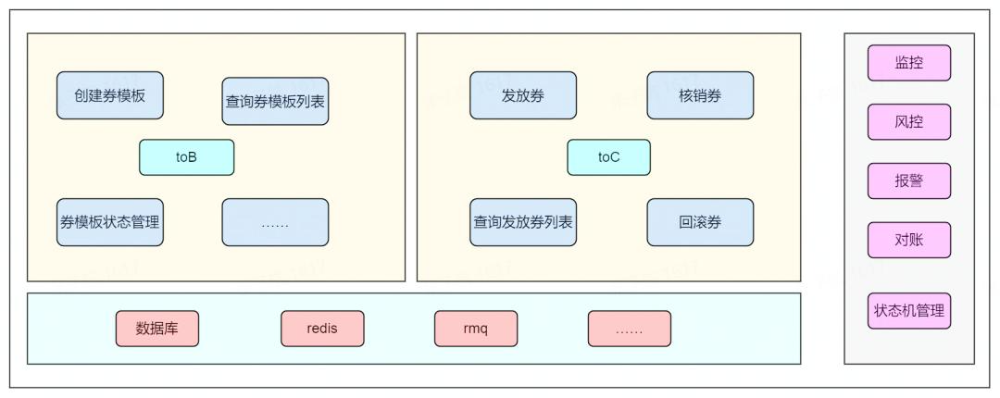
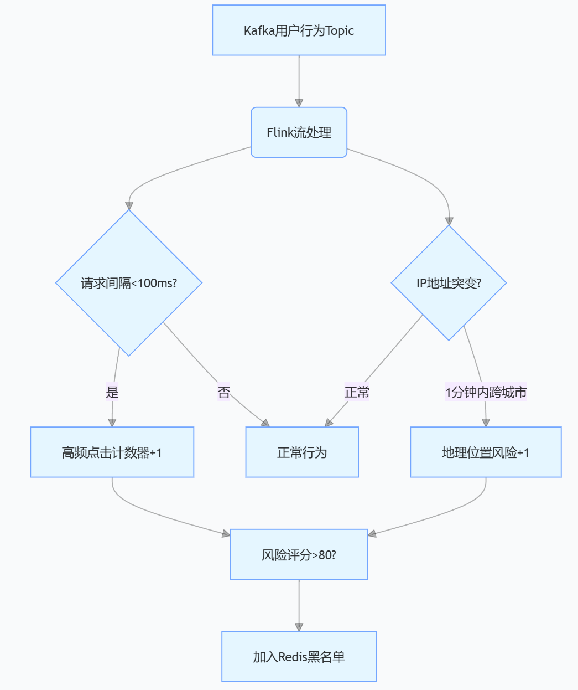
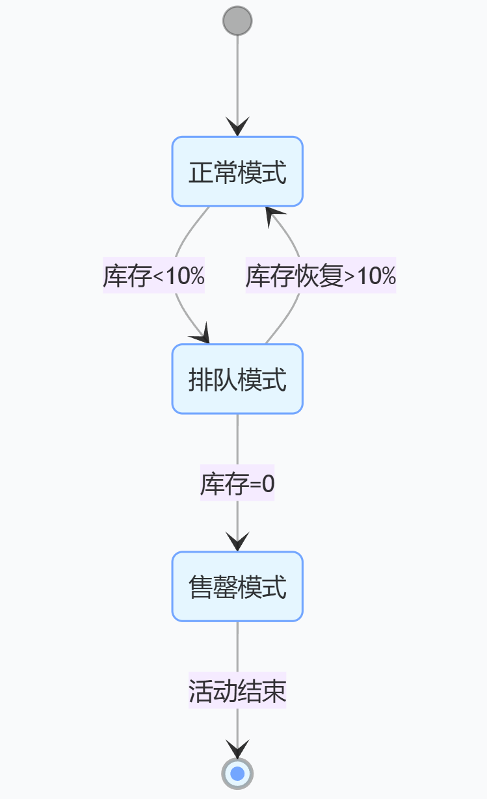

# 高并发抢券系统设计之防刷篇：防刷策略全解析，从规则引擎到智能风控的立体攻防 !



在某直播电商的 618 大促中，某爆款美妆券被黄牛利用脚本在 10 秒内抢空，导致 98% 的真实用户未能参与。这暴露了一个核心问题：**高并发系统的安全性，不仅需要流量限流，更要构建「规则过滤 + 行为识别 + 数据保护」的立体防刷体系**。

本文将从基础规则、智能风控、数据防护三个维度，拆解千万级流量下的防刷实战方案。

<font style="color:rgb(0, 0, 0);">（本文为《高并发抢券系统设计》系列第三篇，点击[回顾限流篇]、[回顾第一篇全链路设计]，聚焦恶意流量清洗与真实用户保护）</font>

## <font style="color:rgb(0, 0, 0);">一、基础防刷：用规则引擎拦截初级恶意流量</font>
### <font style="color:rgb(0, 0, 0);">1. IP 限流：滑动窗口算法的 Redis 实现</font>
**核心数据结构**：使用`ZSET`存储 IP 的请求时间戳（value 为时间戳，score 为请求序号）

```java
// 记录IP请求：key=ip:limit:192.168.1.1，value=时间戳（毫秒级）
public void recordIpRequest(String ip) {
    String key = "ip:limit:" + ip;
    try (Jedis jedis = jedisPool.getResource()) {
        // 1. 添加当前时间戳到ZSET
        jedis.zadd(key, System.currentTimeMillis(), String.valueOf(System.nanoTime())); 
        // 2. 移除5分钟前的过期数据（滑动窗口300秒）
        jedis.zremrangeByScore(key, 0, System.currentTimeMillis() - 300 * 1000); 
    }
}

// 校验IP请求频率：5分钟内超过50次则触发熔断
public boolean checkIpLimit(String ip) {
    String key = "ip:limit:" + ip;
    try (Jedis jedis = jedisPool.getResource()) {
        long count = jedis.zcount(key, 
            System.currentTimeMillis() - 300 * 1000, 
            Double.POSITIVE_INFINITY
        );
        return count > 50;
    }
}
```


_性能优化_：通过`ZREMRANGEBYTIME`（Redis 6.2 + 支持）替代`ZREMRANGEBYSCORE`，时间参数更直观，扫描效率提升 30%。

### <font style="color:rgb(0, 0, 0);">2. 设备指纹：跨端唯一标识的生成与验证</font>
**客户端生成逻辑**（Android 示例）：

```java
public String generateDeviceFingerprint(Context context) {
    return new StringBuilder()
        .append(UUID.randomUUID().toString()) // 随机UUID
        .append(Build.MAC_ADDRESS != null ? Build.MAC_ADDRESS : "") // MAC地址
        .append(Settings.Secure.getString(context.getContentResolver(), 
            Settings.Secure.ANDROID_ID)) // Android ID
        .toString();
}
```

  


**服务端验证逻辑**：

```java
// 设备1分钟内请求超过10次则触发验证码
private static final String DEVICE_LIMIT_KEY = "device:limit:%s"; 

public boolean checkDeviceLimit(String deviceId) {
    String key = String.format(DEVICE_LIMIT_KEY, deviceId);
    try (Jedis jedis = jedisPool.getResource()) {
        long count = jedis.incr(key);
        if (count == 1) {
            jedis.expire(key, 60); // 设置1分钟有效期
        }
        return count > 10;
    }
}
```


_防绕过方案_：对 iOS/Android 端进行签名校验，防止伪造设备 ID；H5 端结合 Cookie+User-Agent 生成指纹，定期清理过期 Cookie。

### <font style="color:rgb(0, 0, 0);">3. 验证码机制：动态触发与第三方集成</font>
**触发条件**（伪代码）：


```java
if (checkIpLimit(ip) || checkDeviceLimit(deviceId)) { 
    return generateCaptcha(); // 返回验证码挑战
}
```


**极验验证码集成**：

```java
// 服务端校验接口
public boolean validateCaptcha(String challenge, String validate, String seckillId) {
    GeetestLib gtSdk = new GeetestLib(GEETEST_ID, GEETEST_KEY);
    Map<String, String> param = new HashMap<>();
    param.put("challenge", challenge);
    param.put("validate", validate);
    param.put("seckillId", seckillId); // 关联本次抢券活动
    int result = gtSdk.successValidate(param, request.getRemoteAddr());
    return result == 1;
}
```

  


_用户体验优化_：对新用户 / 低频用户降低验证码触发阈值，老用户 / 高信任用户设置宽松策略，平衡安全与转化率。

## <font style="color:rgb(0, 0, 0);">二、进阶防刷：实时行为建模与智能风控</font>
### <font style="color:rgb(0, 0, 0);">1. 实时行为分析：Flink 流处理识别异常特征</font>
**数据流架构**：



**关键特征计算**：

```java
// 定义用户行为事件
DataStream<UserEvent> eventStream = ...;

// 计算请求间隔（滑动窗口）
eventStream.keyBy(UserEvent::getUserId)
    .window(SlidingEventTimeWindows.of(Time.seconds(60), Time.milliseconds(100)))
    .process(new ProcessWindowFunction<UserEvent, Double, String, TimeWindow>() {
        @Override
        public void process(String userId, Context context, 
            Iterable<UserEvent> events, Collector<Double> out) {
            List<Long> timestamps = events.stream()
                .map(UserEvent::getTimestamp)
                .sorted()
                .collect(Collectors.toList());
            double avgInterval = calculateAverageInterval(timestamps);
            out.collect(avgInterval); // 输出平均请求间隔
        }
    });

// 地理位置突变检测（调用IP定位API）
private boolean isLocation突变(String oldIp, String newIp) {
    String oldCity = ipToCity(oldIp); // 调用阿里云IP定位
    String newCity = ipToCity(newIp);
    return !oldCity.equals(newCity) && 
        System.currentTimeMillis() - lastCheckTime < 60 * 1000;
}
```

### <font style="color:rgb(0, 0, 0);">2. 黑名单系统：三级联动实现快速拦截</font>
**数据存储架构**：

+ **Redis**：存储实时黑名单（TTL=1 小时），使用`SET`结构（O (1) 查询）
+ **MySQL**：存储历史黑名单（长期存档），字段包括`user_id`, `device_id`, `ip`, `reason`, `create_time`
+ **本地缓存**：加载高频黑名单到 JVM（如 Caffeine，有效期 10 分钟），减少 Redis 访问  


**同步机制**：

```java
// 定时任务：每分钟将Redis黑名单同步到MySQL
@Scheduled(fixedRate = 60 * 1000)
public void syncBlacklistToDB() {
    Set<String> blackKeys = jedis.keys("blacklist:*");
    for (String key : blackKeys) {
        String type = key.split(":")[1]; // 类型：user/device/ip
        String id = jedis.get(key);
        BlacklistEntity entity = new BlacklistEntity();
        entity.setType(type);
        entity.setIdentifier(id);
        entity.setReason("高频请求");
        blacklistRepository.save(entity);
    }
}
```

## <font style="color:rgb(0, 0, 0);">三、数据层防刷：库存分片与熔断保护</font>
### <font style="color:rgb(0, 0, 0);">1. 预扣库存：分片锁降低竞争压力</font>
**库存分片策略**：

```java
// 10万张券拆分为1000个分片，每个分片100张
private static final int SHARD_COUNT = 1000; 

public String deductStock(String couponId, String userId) {
    long shardId = calculateShardId(couponId, userId); // 按用户ID哈希分片
    String lockKey = "stock:lock:" + couponId + ":" + shardId;
    
    try (RedissonLock lock = redisson.getLock(lockKey)) {
        boolean success = lock.tryLock(100, 200, TimeUnit.MILLISECONDS);
        if (success) {
            String stockKey = "stock:shard:" + couponId + ":" + shardId;
            long remaining = jedis.decr(stockKey);
            if (remaining >= 0) { // 扣减成功
                recordOrder(couponId, userId); // 记录订单
                return "抢券成功";
            }
        }
        return "抢券失败";
    } catch (InterruptedException e) {
        return "系统繁忙，请重试";
    }
}

// 分片ID计算（避免热点分片）
private long calculateShardId(String couponId, String userId) {
    long hash = userId.hashCode();
    return Math.abs(hash) % SHARD_COUNT;
}
```


_优势_：将锁粒度从全局锁（1 个锁）细化为分片锁（1000 个锁），并发性能提升 90% 以上。

### <font style="color:rgb(0, 0, 0);">2. 熔断降级：排队模式实现流量削峰</font>
**状态机设计**：



**Kafka 队列处理**：

```java
// 生产者：将请求放入排队队列
public void enqueueSeckill(String userId, String couponId) {
    ProducerRecord<String, String> record = new ProducerRecord<>(
        "seckill_queue", 
        userId, 
        couponId
    );
    kafkaProducer.send(record, (metadata, exception) -> {
        if (exception != null) {
            log.error("排队失败：{}", exception.getMessage());
            fallbackToFailoverQueue(userId, couponId); // 备用队列
        }
    });
}

// 消费者：按顺序处理排队请求
@KafkaListener(topics = "seckill_queue")
public void processQueue(String userId, String couponId) {
    // 检查库存（此时库存已分片预扣）
    if (checkFinalStock(couponId)) { 
        grantCoupon(userId, couponId); // 发放优惠券
    }
}
```


_前端交互_：返回 "排队中" 时，前端轮询接口（间隔 3 秒），显示排队进度条，降低用户流失率。

## <font style="color:rgb(0, 0, 0);">四、防刷策略的三大实战陷阱</font>
1. **设备指纹绕过**
    - _陷阱_：模拟器通过修改 MAC 地址、伪造 Android ID 绕过检测
    - _方案_：增加设备环境检测（如 Root / 越狱检测、模拟器特征识别），结合机器学习模型判断设备真实性
2. **验证码对抗**
    - _陷阱_：OCR 技术破解图形验证码，自动化工具模拟滑动轨迹
    - _方案_：使用动态行为验证码（如随机顺序点击图片、手势轨迹校验），定期更新验证码模板
3. **库存分片热点**
    - _陷阱_：某分片因用户 ID 哈希分布不均导致锁竞争激烈
    - _方案_：引入随机因子（如`userId + random(100)`）计算分片 ID，均衡分片负载

## <font style="color:rgb(0, 0, 0);">总结：防刷系统的核心设计原则</font>
1. **分层防护**：80% 的恶意流量在规则层拦截（IP / 设备限流），15% 通过行为分析识别，5% 依赖数据层保护（库存分片）
2. **动态博弈**：针对刷券工具的升级，定期调整限流阈值（如从 5 分钟 50 次→3 分钟 30 次），更新设备指纹生成逻辑
3. **用户友好**：通过信任评分系统（如会员等级、历史行为）为高价值用户降低验证门槛，平衡安全与用户体验


**思考：当恶意用户使用代理 IP 池（每秒切换 10 个 IP）绕过 IP 限流时，如何提升检测准确率？欢迎在评论区分享你的解决方案。**  


下一篇我们将聚焦幂等性设计，解析如何通过唯一 ID 生成、数据库索引、接口设计确保操作唯一性。


关注【Fox爱分享】，获取《高并发抢券系统设计》全系列更新！

  


****

  
 


> 更新: 2025-04-21 21:21:56  
> 原文: <https://www.yuque.com/u12222632/as5rgl/rqxpsb9zwpnosbgw>