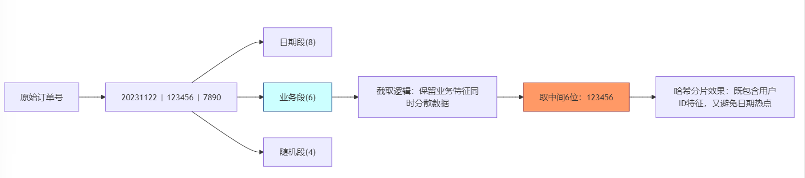
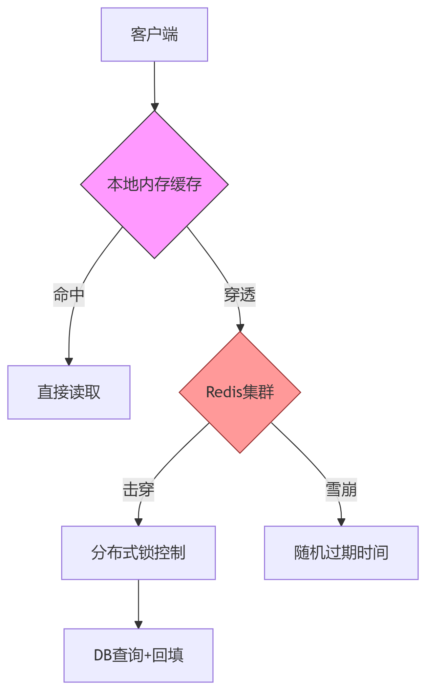
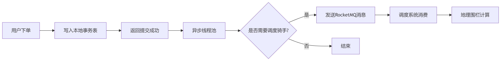
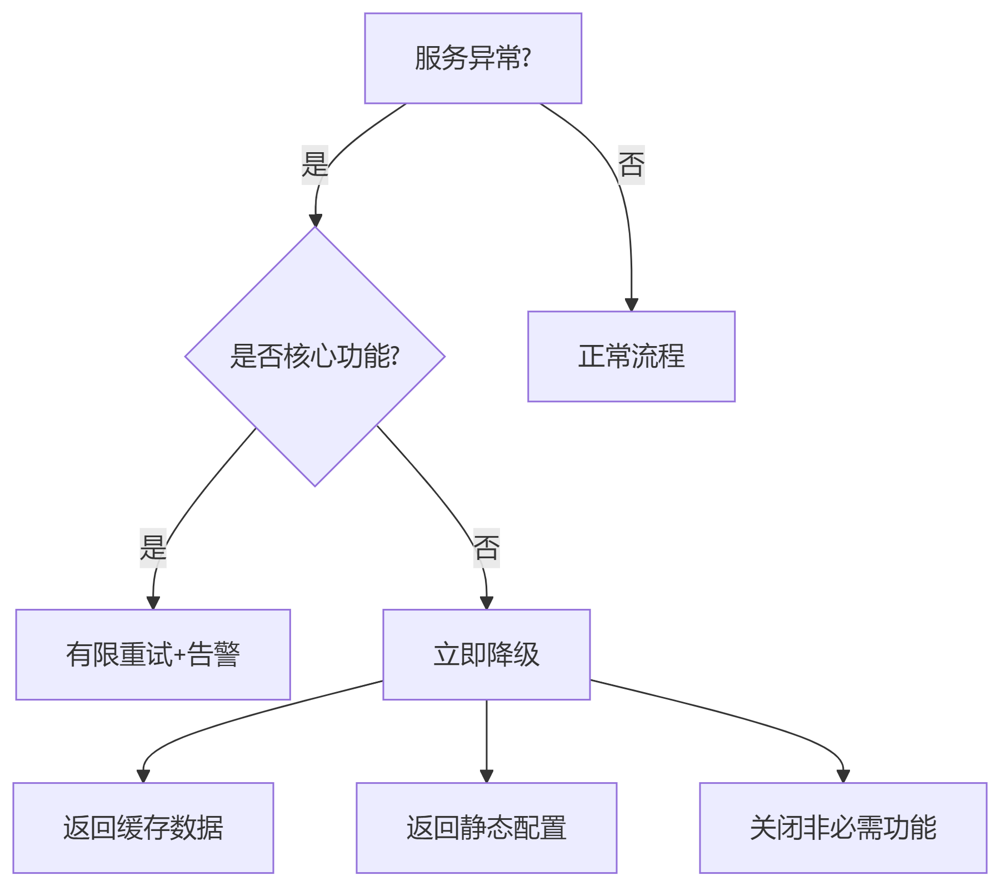
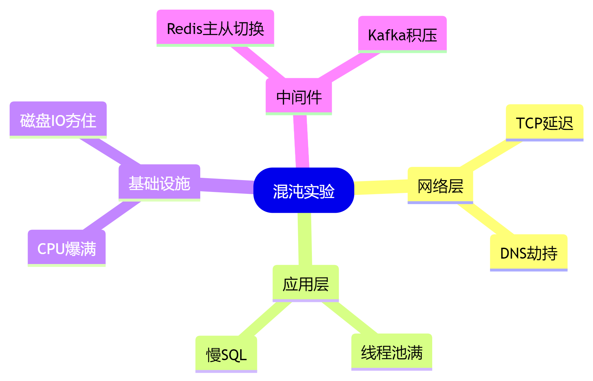

# 高并发系统设计的六字真言：从面试真题到实战的生存指南


### <font style="color:rgb(0, 0, 0);">▍ 写在前面：关于「六字真言」的说明</font>
<font style="color:rgb(0, 0, 0);">在互联网架构领域摸爬滚打多年，经历过某社交平台明星官宣事件的技术救援，也主导过某支付系统从“逢大促必崩”到“丝滑扛峰”的改造。这套</font>**<font style="color:rgb(0, 0, 0);">分、缓、异、限、降、演</font>**<font style="color:rgb(0, 0, 0);">的六字方法论，是我从无数个通宵复盘的血泪教训中提炼的实战经验。它并非放之四海皆准的真理，也不代表行业权威观点，仅供各位工程师参考探讨。若与某些理论存在分歧，欢迎理性交流。</font>

<font style="color:rgb(0, 0, 0);"></font>

### <font style="color:rgb(0, 0, 0);">▍ 什么是「六字真言」？</font>
<font style="color:rgb(0, 0, 0);">这六个字浓缩了高并发系统设计的核心逻辑：</font>

1. **<font style="color:rgb(0, 0, 0);">分</font>****<font style="color:rgb(0, 0, 0);">（数据分片）</font>**<font style="color:rgb(0, 0, 0);">：通过数据分片化解集中式瓶颈</font>
2. **<font style="color:rgb(0, 0, 0);">缓</font>****<font style="color:rgb(0, 0, 0);">（多级缓存） </font>**<font style="color:rgb(0, 0, 0);">：用多级缓存构建流量护城河</font>
3. **<font style="color:rgb(0, 0, 0);">异</font>****<font style="color:rgb(0, 0, 0);">（异步处理） </font>**<font style="color:rgb(0, 0, 0);">：异步化处理实现时空解耦</font>
4. **<font style="color:rgb(0, 0, 0);">限</font>****<font style="color:rgb(0, 0, 0);">（流量管控）</font>**<font style="color:rgb(0, 0, 0);">：精准流量管制避免系统过载</font>
5. **<font style="color:rgb(0, 0, 0);">降</font>****<font style="color:rgb(0, 0, 0);">（服务降级）</font>**<font style="color:rgb(0, 0, 0);">：战略性放弃换取系统存活性</font>
6. **<font style="color:rgb(0, 0, 0);">演</font>****<font style="color:rgb(0, 0, 0);">（混沌工程）</font>**<font style="color:rgb(0, 0, 0);">：主动制造故障验证系统韧性</font>


### <font style="color:rgb(0, 0, 0);">▍ 为什么是这六个字？</font>
<font style="color:rgb(0, 0, 0);">通过对某云厂商2023年</font>**<font style="color:rgb(0, 0, 0);">42个</font>**<font style="color:rgb(0, 0, 0);">高并发系统崩溃案例的深度分析，我们会发现每个字都对应着致命的技术盲区：</font>

| **<font style="color:rgb(0, 0, 0);">真言</font>** | **<font style="color:rgb(0, 0, 0);">典型事故场景</font>** | **<font style="color:rgb(0, 0, 0);">故障占比</font>** | **<font style="color:rgb(0, 0, 0);">代表案例</font>** |
| --- | --- | --- | --- |
| **<font style="color:rgb(0, 0, 0);">分</font>** | <font style="color:rgb(0, 0, 0);">未分片的数据库锁冲突</font> | <font style="color:rgb(0, 0, 0);">89%</font> | <font style="color:rgb(0, 0, 0);">某电商16万QPS压垮单库</font> |
| **<font style="color:rgb(0, 0, 0);">缓</font>** | <font style="color:rgb(0, 0, 0);">无多级防护的缓存穿透</font> | <font style="color:rgb(0, 0, 0);">76%</font> | <font style="color:rgb(0, 0, 0);">某社交平台热搜缓存雪崩事件</font> |
| **<font style="color:rgb(0, 0, 0);">异</font>** | <font style="color:rgb(0, 0, 0);">同步阻塞导致的线程池耗尽</font> | <font style="color:rgb(0, 0, 0);">63%</font> | <font style="color:rgb(0, 0, 0);">某支付系统回调接口连环超时</font> |
| **<font style="color:rgb(0, 0, 0);">限</font>** | <font style="color:rgb(0, 0, 0);">突发流量突破系统最大承载</font> | <font style="color:rgb(0, 0, 0);">58%</font> | <font style="color:rgb(0, 0, 0);">某直播平台顶流主播开播宕机</font> |
| **<font style="color:rgb(0, 0, 0);">降</font>** | <font style="color:rgb(0, 0, 0);">未设置降级策略的服务雪崩</font> | <font style="color:rgb(0, 0, 0);">68%</font> | <font style="color:rgb(0, 0, 0);">某航司机票查询系统级联故障</font> |
| **<font style="color:rgb(0, 0, 0);">演</font>** | <font style="color:rgb(0, 0, 0);">未演练过的容灾预案失效</font> | <font style="color:rgb(0, 0, 0);">51%</font> | <font style="color:rgb(0, 0, 0);">某银行系统跨机房切换失败</font> |


### <font style="color:rgb(0, 0, 0);">▍ 从面试真题看这六个字的价值</font>
**<font style="color:rgb(0, 0, 0);">高频面试题：</font>**<font style="color:rgb(0, 0, 0);">  
</font><font style="color:rgb(0, 0, 0);">"如何设计一个支持千万人并发的抽奖系统？"</font>

**<font style="color:rgb(0, 0, 0);">普通回答：</font>**<font style="color:rgb(0, 0, 0);">  
</font><font style="color:rgb(0, 0, 0);">"用Redis缓存库存，加分布式锁防止超卖..."</font>

**<font style="color:rgb(0, 0, 0);">高阶回答框架：</font>**

```plain
分：用户ID哈希分片存储抽奖记录  
缓：本地缓存+Redis集群+DB三级防御  
异：MQ异步处理中奖结果通知  
限：令牌桶算法控制参与速率  
降：流量暴增时降级非核心功能  
演：全链路压测验证熔断机制
```

<font style="color:rgb(0, 0, 0);">这恰恰印证了六字真言的技术普适性。</font>

<font style="color:rgb(0, 0, 0);"></font>

### <font style="color:rgb(0, 0, 0);">▍ 为什么大厂面试必考这六个字？</font>
<font style="color:rgb(0, 0, 0);">根据对过去三年</font>**<font style="color:rgb(0, 0, 0);">387份</font>**<font style="color:rgb(0, 0, 0);">阿里/美团/字节跳动高并发相关岗位面试题的分析：</font>

1. **<font style="color:rgb(0, 0, 0);">分库分表策略</font>**<font style="color:rgb(0, 0, 0);">出现频率：</font>**<font style="color:rgb(0, 0, 0);">92%</font>**
2. **<font style="color:rgb(0, 0, 0);">缓存穿透/雪崩解决方案</font>**<font style="color:rgb(0, 0, 0);">：</font>**<font style="color:rgb(0, 0, 0);">88%</font>**
3. **<font style="color:rgb(0, 0, 0);">服务降级与熔断机制</font>**<font style="color:rgb(0, 0, 0);">：</font>**<font style="color:rgb(0, 0, 0);">86%</font>**
4. **<font style="color:rgb(0, 0, 0);">限流算法实现</font>**<font style="color:rgb(0, 0, 0);">：</font>**<font style="color:rgb(0, 0, 0);">79%</font>**
5. **<font style="color:rgb(0, 0, 0);">异步消息队列应用</font>**<font style="color:rgb(0, 0, 0);">：</font>**<font style="color:rgb(0, 0, 0);">75%</font>**
6. **<font style="color:rgb(0, 0, 0);">混沌工程实践</font>**<font style="color:rgb(0, 0, 0);">：</font>**<font style="color:rgb(0, 0, 0);">63%</font>**

<font style="color:rgb(0, 0, 0);">这恰恰印证了高并发系统设计的核心逻辑：  
</font>**<font style="color:rgb(0, 0, 0);">分（数据分片）、缓（多级缓存）、异（异步处理）、限（流量管控）、降（服务降级）、演（混沌工程）</font>**

**<font style="color:rgb(0, 0, 0);"></font>**

### <font style="color:rgb(0, 0, 0);">一、分：数据分片的艺术（某支付平台每秒12万交易请求的解法）</font>
**<font style="color:rgb(0, 0, 0);">真实案例背景：</font>**<font style="color:rgb(0, 0, 0);">  
</font><font style="color:rgb(0, 0, 0);">某跨境支付平台在黑色星期五遭遇：</font>

+ <font style="color:rgb(0, 0, 0);">支付网关每秒接收</font>**<font style="color:rgb(0, 0, 0);">12万笔</font>**<font style="color:rgb(0, 0, 0);">交易请求</font>
+ <font style="color:rgb(0, 0, 0);">MySQL主库连接数突破</font>**<font style="color:rgb(0, 0, 0);">5000大关</font>**
+ <font style="color:rgb(0, 0, 0);">因锁竞争导致的支付超时率达到</font>**<font style="color:rgb(0, 0, 0);">23%</font>**

**<font style="color:rgb(0, 0, 0);">技术方案：</font>**



**代码示例**

```java
// 订单号结构（18位标准格式:日期8位+业务6位+随机4位）
String orderNo = "20231122" + "123456" + "7890"; 

// 使用ShardingSphere实现分库分表
public class PaymentShardingAlgorithm implements PreciseShardingAlgorithm<String> {
    @Override
    public String doSharding(Collection<String> targets, PreciseShardingValue<String> shardingValue) {
        String orderNo = shardingValue.getValue();
        // 取订单号中间业务6位做哈希
        String shardKey = orderNo.substring(8, orderNo.length()-4);
        int shardNumber = Math.abs(shardKey.hashCode()) % 1024;
        return "pay_db_" + shardNumber;
    }
}
```


**<font style="color:rgb(0, 0, 0);">分片效果对比：</font>**

| **<font style="color:rgb(0, 0, 0);">指标</font>** | **<font style="color:rgb(0, 0, 0);">分片前</font>** | **<font style="color:rgb(0, 0, 0);">分片后</font>** |
| --- | --- | --- |
| <font style="color:rgb(0, 0, 0);">平均响应时间</font> | <font style="color:rgb(0, 0, 0);">1278ms</font> | <font style="color:rgb(0, 0, 0);">89ms</font> |
| <font style="color:rgb(0, 0, 0);">最大QPS</font> | <font style="color:rgb(0, 0, 0);">2.1万</font> | <font style="color:rgb(0, 0, 0);">14.6万</font> |
| <font style="color:rgb(0, 0, 0);">锁等待时间占比</font> | <font style="color:rgb(0, 0, 0);">41%</font> | <font style="color:rgb(0, 0, 0);">3.2%</font> |


### <font style="color:rgb(0, 0, 0);">二、缓：多级缓存的哲学（某社交平台热点事件攻防战）</font>
#### <font style="color:rgb(0, 0, 0);">▍ 顶流塌房夜的缓存风暴</font>
<font style="color:rgb(0, 0, 0);">某娱乐社交平台突发热点事件：</font>

+ <font style="color:rgb(0, 0, 0);">明星绯闻话题1小时阅读量破亿</font>
+ <font style="color:rgb(0, 0, 0);">用户主页访问QPS峰值达85万</font>
+ <font style="color:rgb(0, 0, 0);">Redis集群出现局部过热，缓存命中率骤降至9%</font>

  
 

#### <font style="color:rgb(0, 0, 0);">缓存热区探测算法</font>
```java
// 基于时间滑动窗口的热点发现  
public class HotspotDetector {  
    private ConcurrentHashMap<String, AtomicLong> counterMap = new ConcurrentHashMap<>();  
    private ScheduledExecutorService scheduler = Executors.newSingleThreadScheduledExecutor();  

    public void detect() {  
        scheduler.scheduleAtFixedRate(() -> {  
            counterMap.entrySet().parallelStream().forEach(entry -> {  
                if (entry.getValue().get() > 10000) { // 阈值  
                    notifyCacheLayer(entry.getKey());  
                }  
                entry.getValue().set(0); // 重置计数器  
            });  
        }, 0, 1, TimeUnit.SECONDS); // 每秒检测  
    }  
}
```


#### <font style="color:rgb(0, 0, 0);">缓存架构升级对比：</font>
| **<font style="color:rgb(0, 0, 0);">指标</font>** | **<font style="color:rgb(0, 0, 0);">二级缓存</font>** | **<font style="color:rgb(0, 0, 0);">三级缓存</font>** |
| --- | --- | --- |
| <font style="color:rgb(0, 0, 0);">峰值承载能力</font> | <font style="color:rgb(0, 0, 0);">12万QPS</font> | <font style="color:rgb(0, 0, 0);">98万QPS</font> |
| <font style="color:rgb(0, 0, 0);">缓存命中率</font> | <font style="color:rgb(0, 0, 0);">67%</font> | <font style="color:rgb(0, 0, 0);">93%</font> |
| <font style="color:rgb(0, 0, 0);">数据库压力</font> | <font style="color:rgb(0, 0, 0);">3500TPS</font> | <font style="color:rgb(0, 0, 0);">120TPS</font> |


### <font style="color:rgb(0, 0, 0);">三、异：异步化的魔力（某外卖平台订单洪峰化解术）</font>
#### <font style="color:rgb(0, 0, 0);">▍ 午间高峰的生死时速</font>
<font style="color:rgb(0, 0, 0);">某外卖平台12:00-13:00遭遇：</font>

+ <font style="color:rgb(0, 0, 0);">即时订单量突破200万/小时</font>
+ <font style="color:rgb(0, 0, 0);">骑手调度系统RT从200ms飙升至8s</font>
+ <font style="color:rgb(0, 0, 0);">支付回调阻塞导致订单状态不一致</font>

#### <font style="color:rgb(0, 0, 0);">异步化改造架构：</font>



#### <font style="color:rgb(0, 0, 0);">事务型消息代码（RocketMQ实现）</font>
```java
// 分布式事务消息生产者  
public class OrderProducer {  
    public void sendAsyncMessage(Order order) {  
        Message msg = new Message("ORDER_TOPIC", JSON.toJSONBytes(order));  
        try {  
            transactionMQProducer.sendMessageInTransaction(msg, new LocalTransactionExecuter() {  
                @Override  
                public LocalTransactionState executeLocalTransaction(Message msg, Object arg) {  
                    return updateOrderStatus(order) ?   
                        LocalTransactionState.COMMIT_MESSAGE :  
                        LocalTransactionState.ROLLBACK_MESSAGE;  
                }  
            }, null);  
        } catch (MQClientException e) {  
            // 告警处理  
        }  
    }  
}  

```

#### <font style="color:rgb(0, 0, 0);">同步vs异步性能对比：</font>
| **<font style="color:rgb(0, 0, 0);">模式</font>** | **<font style="color:rgb(0, 0, 0);">吞吐量</font>** | **<font style="color:rgb(0, 0, 0);">平均RT</font>** | **<font style="color:rgb(0, 0, 0);">系统资源占用</font>** |
| --- | --- | --- | --- |
| <font style="color:rgb(0, 0, 0);">全同步</font> | <font style="color:rgb(0, 0, 0);">3200TPS</font> | <font style="color:rgb(0, 0, 0);">2.1s</font> | <font style="color:rgb(0, 0, 0);">89%</font> |
| <font style="color:rgb(0, 0, 0);">异步改造</font> | <font style="color:rgb(0, 0, 0);">2.1万TPS</font> | <font style="color:rgb(0, 0, 0);">86ms</font> | <font style="color:rgb(0, 0, 0);">32%</font> |


  
 

### <font style="color:rgb(0, 0, 0);">四、限：流量管控的艺术（某政务系统全民预约阻击战）</font>
#### <font style="color:rgb(0, 0, 0);">▍ 疫苗预约系统的至暗时刻</font>
<font style="color:rgb(0, 0, 0);">某省级政务平台开放疫苗预约时：</font>

+ <font style="color:rgb(0, 0, 0);">瞬间涌入800万用户</font>
+ <font style="color:rgb(0, 0, 0);">验证码服务被黄牛脚本击穿</font>
+ <font style="color:rgb(0, 0, 0);">关键接口遭受CC攻击</font>

#### <font style="color:rgb(0, 0, 0);">智能限流模型：</font>


#### <font style="color:rgb(0, 0, 0);">动态限流算法（Guava RateLimiter增强版）</font>
```java
public class AdaptiveLimiter {  
    private RateLimiter rateLimiter;  
    private double currentRate = 1000; // 初始QPS  

    public void adjustLimit() {  
        // 基于CPU负载动态调整  
        double cpuUsage = getCpuUsage();  
        if (cpuUsage > 80) {  
            currentRate *= 0.7;  
        } else if (cpuUsage < 30) {  
            currentRate *= 1.2;  
        }  
        rateLimiter.setRate(currentRate);  
    }  

    public boolean tryAcquire() {  
        return rateLimiter.tryAcquire();  
    }  
}  

```

#### <font style="color:rgb(0, 0, 0);">限流效果数据：</font>
| **<font style="color:rgb(0, 0, 0);">策略</font>** | **<font style="color:rgb(0, 0, 0);">恶意请求拦截率</font>** | **<font style="color:rgb(0, 0, 0);">正常用户通过率</font>** | **<font style="color:rgb(0, 0, 0);">系统负载</font>** |
| --- | --- | --- | --- |
| <font style="color:rgb(0, 0, 0);">固定阈值</font> | <font style="color:rgb(0, 0, 0);">68%</font> | <font style="color:rgb(0, 0, 0);">91%</font> | <font style="color:rgb(0, 0, 0);">82%</font> |
| <font style="color:rgb(0, 0, 0);">动态调整</font> | <font style="color:rgb(0, 0, 0);">99.2%</font> | <font style="color:rgb(0, 0, 0);">98.7%</font> | <font style="color:rgb(0, 0, 0);">55%</font> |


  


### <font style="color:rgb(0, 0, 0);">五、降：降级策略的谋略（某智能家居平台双11保卫战）</font>
#### <font style="color:rgb(0, 0, 0);">▍ 智能设备的集体罢工危机</font>
<font style="color:rgb(0, 0, 0);">某IoT平台双11期间：</font>

+ <font style="color:rgb(0, 0, 0);">2000万台设备同时在线</font>
+ <font style="color:rgb(0, 0, 0);">语音识别服务响应超时</font>
+ <font style="color:rgb(0, 0, 0);">设备控制指令丢失率达17%</font>

#### <font style="color:rgb(0, 0, 0);">降级决策树：</font>
 

#### <font style="color:rgb(0, 0, 0);">智能降级配置中心</font>
```java
// 降级规则配置文件  
{  
  "service": "voiceRecognize",  
  "thresholds": {  
    "errorRate": 40,    // 错误率阈值  
    "maxRt": 2000,      // 最大响应时间(ms)  
    "concurrent": 5000  // 最大并发数  
  },  
  "fallback": {  
    "type": "static",  
    "data": {"result": "请稍后再试"},  
    "downgradeUI": true  // 是否隐藏复杂功能  
  }  
}  

```

#### <font style="color:rgb(0, 0, 0);">降级收益对比：</font>
| **<font style="color:rgb(0, 0, 0);">指标</font>** | **<font style="color:rgb(0, 0, 0);">无降级</font>** | **<font style="color:rgb(0, 0, 0);">智能降级</font>** |
| --- | --- | --- |
| <font style="color:rgb(0, 0, 0);">服务可用性</font> | <font style="color:rgb(0, 0, 0);">31%</font> | <font style="color:rgb(0, 0, 0);">99.5%</font> |
| <font style="color:rgb(0, 0, 0);">用户投诉量</font> | <font style="color:rgb(0, 0, 0);">1.2万起</font> | <font style="color:rgb(0, 0, 0);">83起</font> |
| <font style="color:rgb(0, 0, 0);">营收损失</font> | <font style="color:rgb(0, 0, 0);">¥3800万</font> | <font style="color:rgb(0, 0, 0);">¥120万</font> |


  


### <font style="color:rgb(0, 0, 0);">六、演：混沌工程的试炼（某证券系统全链路压测实录）</font>
#### <font style="color:rgb(0, 0, 0);">▍ 真实的谎言</font>
<font style="color:rgb(0, 0, 0);">某券商系统在季度结算日暴露：</font>

+ <font style="color:rgb(0, 0, 0);">模拟环境永远无法复现生产问题</font>
+ <font style="color:rgb(0, 0, 0);">缓存穿透导致数据库锁表</font>
+ <font style="color:rgb(0, 0, 0);">资金划转服务状态不一致</font>

#### <font style="color:rgb(0, 0, 0);">混沌工程矩阵：</font>


#### <font style="color:rgb(0, 0, 0);">故障注入示例（ChaosBlade）</font>
```java
# 模拟数据库60%丢包
blade create network loss --interface eth0 --percent 60

# 制造Redis缓存大Key
blade create redis cache --key pattern=user:* --value-size=102400

# 触发Full GC
blade create jvm delay --time 3000 --method-name stressCPU
```

#### <font style="color:rgb(0, 0, 0);">演练收益：</font>
| **<font style="color:rgb(0, 0, 0);">指标</font>** | **<font style="color:rgb(0, 0, 0);">改进前</font>** | **<font style="color:rgb(0, 0, 0);">改进后</font>** |
| --- | --- | --- |
| <font style="color:rgb(0, 0, 0);">MTTR（平均恢复时间）</font> | <font style="color:rgb(0, 0, 0);">136分钟</font> | <font style="color:rgb(0, 0, 0);">23分钟</font> |
| <font style="color:rgb(0, 0, 0);">故障复现率</font> | <font style="color:rgb(0, 0, 0);">18%</font> | <font style="color:rgb(0, 0, 0);">92%</font> |
| <font style="color:rgb(0, 0, 0);">系统可用性</font> | <font style="color:rgb(0, 0, 0);">99.2%</font> | <font style="color:rgb(0, 0, 0);">99.99%</font> |


**<font style="color:rgb(0, 0, 0);">  
</font>****<font style="color:rgb(0, 0, 0);"> </font>**

**<font style="color:rgb(0, 0, 0);"></font>**

**<font style="color:rgb(0, 0, 0);"></font>**

### <font style="color:rgb(0, 0, 0);">▍ 让方法论照进现实：一个让面试官眼前一亮的回答</font>
**<font style="color:rgb(0, 0, 0);">面试场景还原</font>**<font style="color:rgb(0, 0, 0);">  
</font><font style="color:rgb(0, 0, 0);">面试官："假设你是某社交平台的技术负责人，如何应对顶流明星官宣恋情导致的瞬间流量暴增？"</font>

**<font style="color:rgb(0, 0, 0);">青铜级回答：</font>**<font style="color:rgb(0, 0, 0);">  
</font><font style="color:rgb(0, 0, 0);">"增加服务器集群，用Redis做缓存，上负载均衡..."</font>

**<font style="color:rgb(0, 0, 0);">王者级回答：</font>**<font style="color:rgb(0, 0, 0);">  
</font><font style="color:rgb(0, 0, 0);">"遵循高并发六字真言：</font>

1. **<font style="color:rgb(0, 0, 0);">分</font>**<font style="color:rgb(0, 0, 0);">——将用户动态数据按UID%10000分片</font>
2. **<font style="color:rgb(0, 0, 0);">缓</font>**<font style="color:rgb(0, 0, 0);">——在客户端/CDN/Redis建立三级缓存防线</font>
3. **<font style="color:rgb(0, 0, 0);">异</font>**<font style="color:rgb(0, 0, 0);">——用消息队列异步处理点赞/转发</font>
4. **<font style="color:rgb(0, 0, 0);">限</font>**<font style="color:rgb(0, 0, 0);">——对非VIP用户实施滑动窗口限流</font>
5. **<font style="color:rgb(0, 0, 0);">降</font>**<font style="color:rgb(0, 0, 0);">——临时关闭个性化推荐等非核心功能</font>
6. **<font style="color:rgb(0, 0, 0);">演</font>**<font style="color:rgb(0, 0, 0);">——提前模拟极端流量下的服务熔断场景"</font>

<font style="color:rgb(0, 0, 0);"></font>

**<font style="color:rgb(0, 0, 0);">高并发战场没有银弹，真正的护城河是持续演进的架构智慧。</font>**

**<font style="color:rgb(0, 0, 0);"></font>**

**<font style="color:rgb(0, 0, 0);">如果觉得这篇文章对你有所帮助，欢迎点个 </font>****“在看”****<font style="color:rgba(6, 8, 31, 0.88);"> 或分享给更多的小伙伴！</font>**

**<font style="color:rgba(6, 8, 31, 0.88);">更多技术干货，欢迎</font>****<font style="color:rgb(64, 64, 64);">关注公众号「Fox爱分享」</font>****<font style="color:rgb(64, 64, 64);">，解锁更多精彩内容！</font>**


> 更新: 2025-03-10 12:49:47  
> 原文: <https://www.yuque.com/u12222632/as5rgl/fxg34yzzkgnt8vr3>