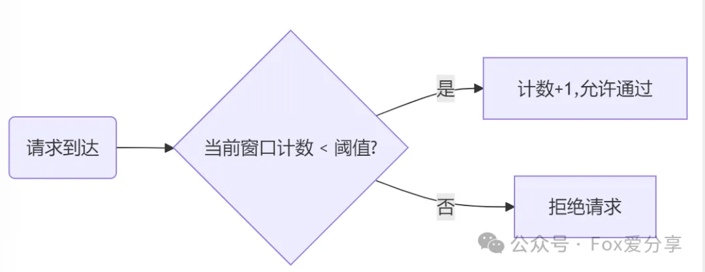
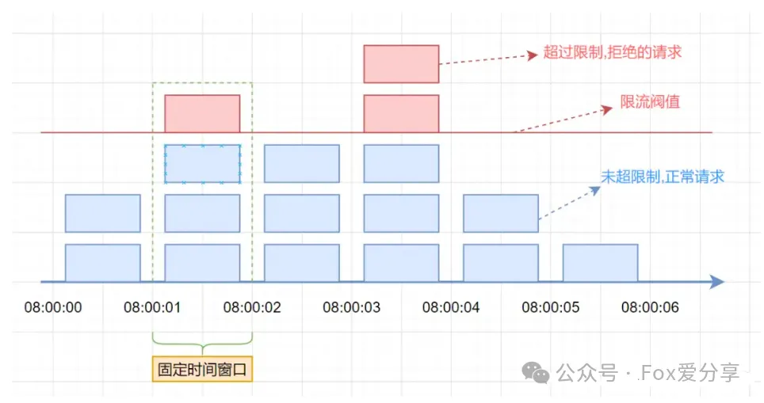
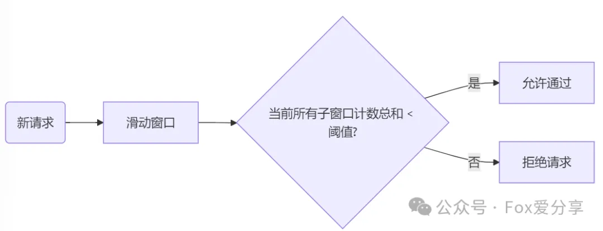
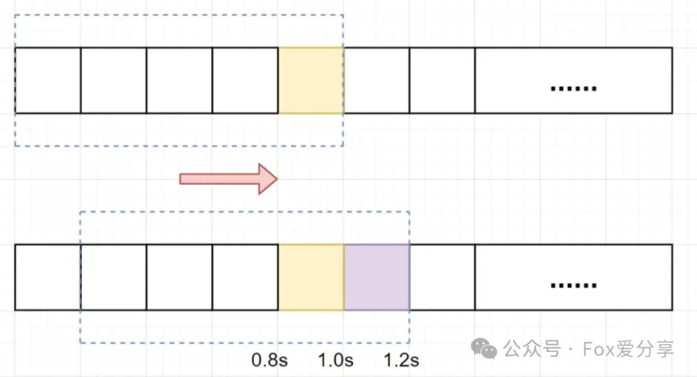
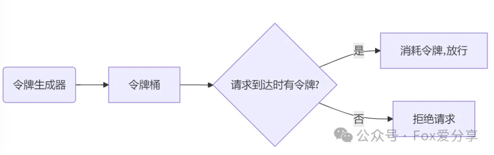
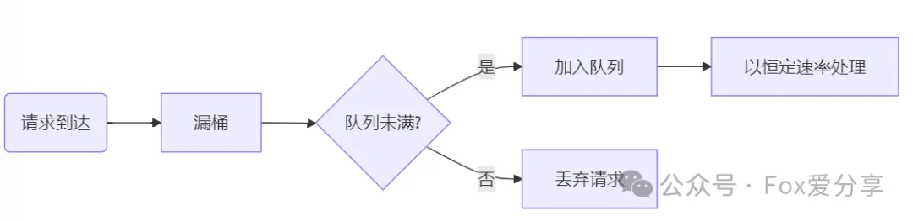

# 高薪Offer必备！四种限流算法一文通关（美团/阿里真题）

#### **一、面试官最爱问的限流算法题**‌
‌**“请解释计数器、滑动窗口、令牌桶、漏桶算法的区别，并说明适用场景？”**

  

#### **二、四大核心限流算法详解**‌
##### **‌****1. 计数器算法：简单但致命的缺陷**‌
**‌****💡****核心原理**‌

+ 统计‌**固定时间窗口**‌内的请求数（如1分钟），超阈值直接拒绝‌  

**假设单位时间(固定时间窗口)是**`**1**`**秒，限流阀值为**`**3**`**。在单位时间**`**1**`**秒内，每来一个请求,计数器就加**`**1**`**，如果计数器累加的次数超过限流阀值**`**3**`**，后续的请求全部拒绝。等到**`**1s**`**结束后，计数器清**`**0**`**，重新开始计数。如下图：**

**致命缺点**‌

+ ‌**临界值问题****‌****：窗口切换时可能****‌****2倍流量冲击**‌。比如我们设定1s内允许通过的请求阈值是100，如果在时间窗口的最后几毫秒发送了99个请求，紧接着又在下一个时间窗口开始时发送了99个请求，那么这个用户其实在一秒显然超过了阈值但并不会被限流。

  
‌**✅****适用场景**‌：低频验证码接口（如短信1分钟1次）‌

##### **‌****2. 滑动窗口算法：精准控流的升级版**‌
‌**💡****核心原理**‌

+ 将大窗口拆分为‌**多个小时间片**‌（如1分钟=6个10秒窗口），动态淘汰过期数据‌。当滑动窗口的**格子周期划分的越多，那么滑动窗口的滚动就越平滑，限流的统计就会越精确**。  

假设单位时间还是`1`s，滑动窗口算法把它划分为`5`个小周期，也就是滑动窗口（**单位时间**）被划分为`5`个小格子。每格表示`0.2s`。每过`0.2s`，时间窗口就会往右滑动一格。然后呢，每个小周期，都有自己独立的计数器，如果请求是`0.83s`到达的，`0.8~1.0s`对应的计数器就会加`1`。

+ ‌**Sentinel框架**‌采用滑动窗口实现微服务熔断，精度比固定窗口提升80%‌。
+   
‌**✅****适用场景**‌：API接口QPS限流（如订单查询每秒100次）‌  

  

##### **3. 令牌桶算法：秒杀系统的救命稻草**‌
‌**💡****核心原理**‌

+ **系统以**‌**恒定速率****‌****生成令牌**，请求需抢到令牌才能执行。**支持突发流量**，比如秒杀系统瞬间大量请求涌入，令牌桶允许前1秒积累的令牌被快速消耗‌。  
  
  

令牌桶算法是**一种常用的限流算法**，可以用于限制单位时间内请求的数量。该算法维护一个固定容量的令牌桶，每秒钟会向令牌桶中放入一定数量的令牌。当有请求到来时，如果令牌桶中有足够的令牌，则请求被允许通过并从令牌桶中消耗一个令牌，否则请求被拒绝。

‌`Guava`的`RateLimiter`限流组件，就是基于令牌桶算法实现的。**  
****  
****✅****适用场景****‌**：高并发突发流量（如抢购、直播互动）‌

  

##### ‌**4. 漏桶算法：保护下游的稳压器**‌
‌**💡****核心原理**‌

+ 强制以‌**固定速率**‌处理请求（如水从漏桶流出），超速请求直接丢弃‌  

我们可以把发请求的动作比作成注水到桶中，我们处理请求的过程可以比喻为漏桶漏水。我们往桶中以任意速率流入水，以一定速率流出水。当水超过桶流量则丢弃，因为桶容量是不变的，保证了整体的速率。

**Nginx限流模块**‌底层采用漏桶算法，防止下游服务被压垮‌  
**  
****  
****✅****适用场景**‌：API网关流量整形（如支付接口平滑调用）‌  

  

#### **‌****三、四种算法对比表**
| **‌****算法****‌** | **‌****核心优势****‌** | **‌****缺陷****‌** | **‌****适用场景****‌** |
| :--- | :--- | :--- | :--- |
| 计数器 | 实现简单 | 临界值问题 | 低频验证码 |
| 滑动窗口 | 精度高 | 计算复杂度高 | API接口QPS限制 |
| 令牌桶 | 支持突发流量 | 需要维护令牌池 | 秒杀、直播等高并发 |
| 漏桶 | 强制平滑输出 | 无法应对突发流量 | API网关流量整形 |

  

#### **四、面试加分技巧**‌
1. ‌**分布式限流方案****‌：**
    - 答“Redis+Lua原子计数”比“单机限流”更显技术深度‌
2. ‌**算法组合使用****‌：**
    - 举例“网关层用漏桶平滑流量，业务层用令牌桶应对突发”‌
3. **‌****动态调整阈值****‌：**
    - 强调“根据系统实时负载（如CPU、内存、QPS等）‌**自动调节限流阈值”能打动面试官‌**  

  
  
**最后的思考：如何实现根据系统CPU负载动态调整限流阈值？**  

**动态调整阈值是系统高可用设计的核心。**

以美团外卖为例，午高峰时系统CPU可能飙升至80%，此时自动将订单接口QPS阈值从2000降至1500，优先保障核心交易链路；而在低峰期，阈值恢复甚至上浮，避免资源浪费。

**  
**

**如果觉得这篇文章对你有所帮助，欢迎点个 ****“在看”**** ****或分享给更多的小伙伴！**

**关注公众号「****Fox爱分享****」**，**解锁更多精彩内容！**

  
 

> 更新: 2025-03-10 12:53:21  
> 原文: <https://www.yuque.com/u12222632/as5rgl/qxvh2hx0yxpllhob>